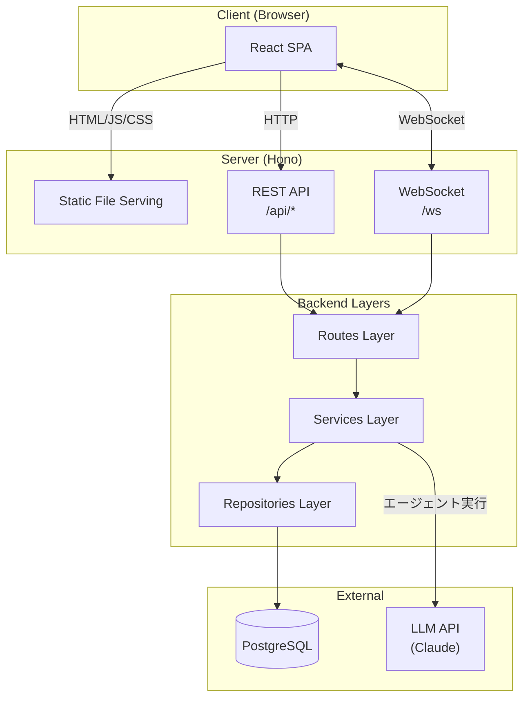
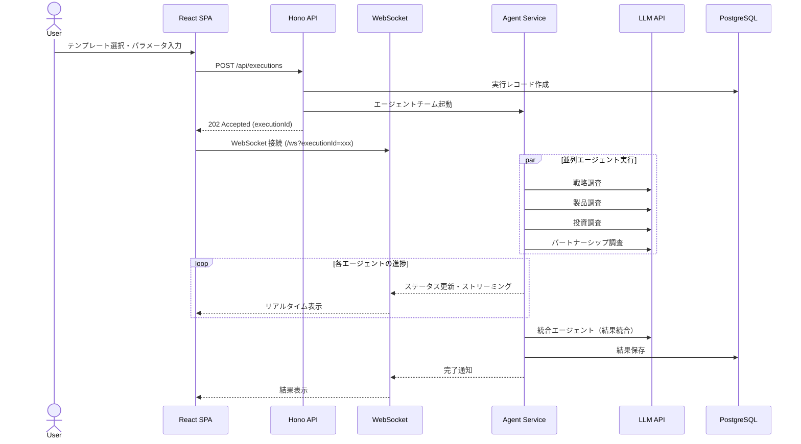
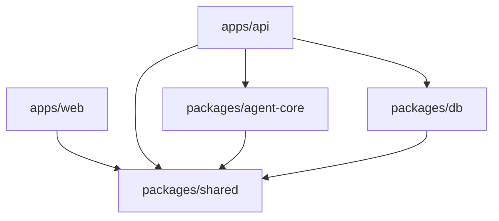

# 0009. リポジトリ構成・アーキテクチャ方針

## Status

accepted

- 作成日: 2026-04-17
- 関連: ADR-0005（前提）, ADR-0008（前提）, Issue #11

## Context

ADR-0005 で MVP スコープ（競合調査の並列深掘り）、ADR-0008 で技術スタック（Bun, Hono, React+Vite SPA, PostgreSQL+Drizzle）とモノレポのトップレベル構成が確定した。

本 ADR では以下を決定する：

- API 設計方式（REST / tRPC / GraphQL）
- バックエンドの内部アーキテクチャパターン
- フロントエンドのディレクトリ構成方針
- 各パッケージの詳細ディレクトリ構成

PM 1人 + エンジニア 1人の体制で保守可能な、シンプルかつ拡張性のある構成を目指す。

## Considered Alternatives

### API 設計

| # | 選択肢 | 判定 |
| - | --- | --- |
| A | REST + WebSocket | **採用** — Hono の型安全ルーティングと `packages/shared` の型定義で型安全性を確保。REST は CRUD 操作、WebSocket はリアルタイム通信と役割が明確に分かれる。シンプルで学習価値が高い |
| B | tRPC | 却下 — E2E 型安全を自動化できるが、Hono との統合に trpc-hono-adapter が必要で追加の学習レイヤーが増える。WebSocket との統合も tRPC subscriptions 経由になり、素の WebSocket の理解が深まらない |
| C | GraphQL | 却下 — MVP の API は単純な CRUD + WebSocket であり、柔軟なクエリが必要な場面がない。スキーマ定義のオーバーヘッドが大きい |

### バックエンドの内部アーキテクチャ

| # | 選択肢 | 判定 |
| - | --- | --- |
| A | レイヤードアーキテクチャ | **採用** — routes → services → repositories の 3 層。MVP のドメインモデル（テンプレート・実行・結果）の規模に対して適切。Hono + Drizzle の軽量さを活かせる。service 層にロジックを集約しておけば、将来クリーンアーキテクチャへの進化も可能 |
| B | クリーンアーキテクチャ | 却下 — 依存性逆転による外部技術の分離は設計原則として優れるが、MVP のエンティティ数（3 つ程度）に対してインターフェース定義・DI の仕組みがボイラープレート過多になる。1 人チームでは抽象化の恩恵（チーム間境界の制御）より見通しの良さが重要 |

### フロントエンドのディレクトリ構成

| # | 選択肢 | 判定 |
| - | --- | --- |
| A | Feature-based | **採用** — 機能単位でコンポーネント・hooks・型をまとめる。関連コードが近くにあり変更の影響範囲が明確。MVP の 3 画面（テンプレート選択・実行進捗・履歴）が自然に features/ にマッピングされる |
| B | Layer-based | 却下 — 技術レイヤー（components/, hooks/, services/）で分ける従来型の構成。機能が増えると各ディレクトリが肥大化し、関連コードの追跡が困難になる |

## Decision

### 全体アーキテクチャ



### データフロー



### 詳細ディレクトリ構成

```text
agent-team-studio/
├── apps/
│   ├── web/                          # React + Vite (SPA)
│   │   ├── src/
│   │   │   ├── features/            # 機能単位のモジュール
│   │   │   │   ├── template-select/ # テンプレート選択画面
│   │   │   │   │   ├── components/
│   │   │   │   │   ├── hooks/
│   │   │   │   │   └── index.ts
│   │   │   │   ├── execution/       # 実行・リアルタイム進捗表示
│   │   │   │   │   ├── components/
│   │   │   │   │   ├── hooks/
│   │   │   │   │   └── index.ts
│   │   │   │   └── history/         # 実行履歴
│   │   │   │       ├── components/
│   │   │   │       ├── hooks/
│   │   │   │       └── index.ts
│   │   │   ├── components/          # 共通 UI コンポーネント（shadcn/ui）
│   │   │   ├── lib/                 # ユーティリティ（API クライアント等）
│   │   │   ├── App.tsx
│   │   │   └── main.tsx
│   │   ├── index.html
│   │   ├── vite.config.ts
│   │   ├── tsconfig.json
│   │   └── package.json
│   │
│   └── api/                          # Hono — API + WebSocket + SPA 配信
│       ├── src/
│       │   ├── routes/              # HTTP/WS ハンドラ（入出力の変換）
│       │   │   ├── executions.ts
│       │   │   ├── templates.ts
│       │   │   └── ws.ts
│       │   ├── services/            # ビジネスロジック
│       │   │   ├── execution.service.ts
│       │   │   └── template.service.ts
│       │   ├── repositories/        # データアクセス（Drizzle）
│       │   │   ├── execution.repo.ts
│       │   │   └── template.repo.ts
│       │   └── index.ts             # Hono app 組み立て・起動
│       ├── tsconfig.json
│       └── package.json
│
├── packages/
│   ├── shared/                       # フロント・バックエンド共有
│   │   ├── src/
│   │   │   ├── api-types.ts         # REST API のリクエスト・レスポンス型
│   │   │   ├── ws-types.ts          # WebSocket メッセージ型
│   │   │   ├── domain-types.ts      # ドメインモデルの型（Template, Execution 等）
│   │   │   └── index.ts
│   │   ├── tsconfig.json
│   │   └── package.json
│   │
│   ├── agent-core/                   # エージェント実行エンジン
│   │   ├── src/
│   │   │   ├── engine.ts            # エージェントチームの実行制御
│   │   │   ├── agent.ts             # 個別エージェントの実行
│   │   │   ├── llm-client.ts        # LLM API クライアント
│   │   │   └── index.ts
│   │   ├── tsconfig.json
│   │   └── package.json
│   │
│   └── db/                           # Drizzle スキーマ・マイグレーション
│       ├── src/
│       │   ├── schema/              # テーブル定義
│       │   │   ├── templates.ts
│       │   │   ├── executions.ts
│       │   │   └── index.ts
│       │   ├── client.ts            # DB 接続
│       │   └── index.ts
│       ├── drizzle/                  # マイグレーションファイル（自動生成）
│       ├── drizzle.config.ts
│       ├── tsconfig.json
│       └── package.json
│
├── package.json                      # ルート（workspace 定義）
├── tsconfig.base.json
├── biome.json
└── turbo.json
```

### パッケージ間の依存方向



ADR-0008 で定義した依存方向を維持する。循環依存は禁止。

### レイヤーの責務

| レイヤー | 責務 | 依存先 |
| --- | --- | --- |
| Routes | HTTP/WebSocket リクエストの受信、バリデーション、レスポンス整形 | Services |
| Services | ビジネスロジック、エージェント実行の制御、トランザクション管理 | Repositories, agent-core |
| Repositories | Drizzle 経由のデータアクセス。SQL の構築と実行 | packages/db |

### REST API 設計方針

- リソース指向の URL 設計（`/api/templates`, `/api/executions`）
- HTTP メソッドで操作を表現（GET: 取得, POST: 作成）
- レスポンスは JSON。エラーレスポンスの型・語彙・HTTP ステータス対応は [api-design.md §エラーレスポンス](../design/api-design.md) を参照（`errorCode` による discriminated union）
- 型定義は `packages/shared/src/api-types.ts` で一元管理し、フロント・バックエンド双方から参照

### WebSocket 設計方針

- 接続エンドポイント: `/ws?executionId=<id>`
- サーバー→クライアントの一方向プッシュが主。クライアント→サーバーは接続確立時のみ
- メッセージ型は `packages/shared/src/ws-types.ts` で定義。`type` フィールドで種別を識別する discriminated union

### 開発時のサーバー構成

- Vite dev server（apps/web）: HMR 付きの開発サーバー
- Hono dev server（apps/api）: API + WebSocket
- Vite のプロキシ設定で `/api/*` と `/ws` を Hono に転送し、CORS を回避

## Consequences

### ポジティブ

- REST + WebSocket の明確な役割分担により、CRUD とリアルタイム通信の設計が分離され、各部分を独立して開発・テストできる
- レイヤードアーキテクチャにより、ルーティング・ビジネスロジック・データアクセスの境界が明確で、1 人チームでもコードの見通しが良い
- Feature-based なフロントエンド構成により、画面単位の開発・修正で影響範囲が局所化される
- `packages/shared` での型共有により、API の型不整合がコンパイル時に検出される
- ADR-0008 のモノレポ構成を踏襲し、パッケージ間依存が一方向に制限されるため、変更の波及が予測しやすい

### ネガティブ / リスク

- REST は tRPC に比べて型安全性の自動化度が低く、`packages/shared` の型定義を手動で API 実装と同期させる規律が必要
- レイヤードアーキテクチャは依存方向の強制がコンパイラレベルでは行われないため、service が route を直接呼ぶような逆方向の依存を開発者が自律的に避ける必要がある
- Feature-based 構成は、複数 feature にまたがるコンポーネントの配置判断が曖昧になる場合がある（`components/` に昇格させる基準をチーム内で共有する必要がある）
