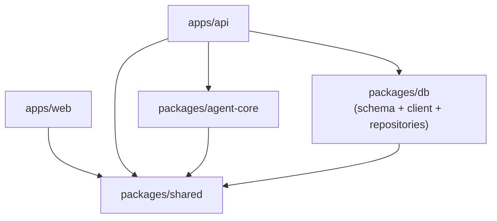

# 0023. repo 層の物理的配置を packages/db に確定（ADR-0009 部分スーパーシード）

## Status

accepted（部分的に supersedes [ADR-0009](./0009-architecture.md)）

- 作成日: 2026-05-03
- 関連: [ADR-0009](./0009-architecture.md)（supersedes 部分）, [ADR-0008](./0008-tech-stack.md)（前提：モノレポ依存方向）, [ADR-0021](./0021-doc-cross-reference-policy.md)（前提：参照ポリシー）, Issue #82, PR #114, Issue #115

## Context

ADR-0009 はバックエンドの内部アーキテクチャとしてレイヤード（routes → services → repositories）を採用し、詳細ディレクトリ構成図で repositories の物理的住所を `apps/api/src/repositories/` と指定していた。

PR #114（Walking Skeleton, Issue #82）の実装過程で、`templates` の repo を `packages/db/src/repositories/templates.ts` に配置した。これは Drizzle スキーマ（`packages/db/src/schema/`）と repo を同居させた方が schema 変更時の追従が容易、かつ `templates.$inferSelect` 等の派生型を import 1 本で完結させられるという実装上の判断による。結果として ADR-0009 の指定との乖離が生じた。

US-1 で `executions` の repo を追加する直前に方針を確定しないと、後から templates / executions 両方を移動するコンフリクトリスクが大きい。本 ADR では repo 層の物理的住所のみを再決定する（API 設計・フロント設計・レイヤード構造そのものは ADR-0009 のまま有効）。

## Considered Alternatives

### repo 層の物理的住所

| # | 選択肢 | 判定 |
| - | --- | --- |
| A | `apps/api/src/repositories/` に集約（ADR-0009 原案） | 却下 — ADR の SSoT 性は保てるが、Drizzle 派生型のために `@agent-team-studio/db` から schema を import する必要があり、schema 変更時の追従コストが残る。agent-core / 将来の CLI スクリプト等が apps/api を経由しないと repo を再利用できない |
| B | `packages/db/src/repositories/` に集約 | **採用** — Drizzle スキーマと物理的に同居するため、`$inferSelect` 等の派生型が同一パッケージ内で完結する。`@agent-team-studio/db` を依存に持つ任意のコンシューマ（apps/api / packages/agent-core / 将来の CLI）から repo を直接呼べる。レイヤード構造の依存方向（routes → services → repositories）は不変 |

### 決定の形式（ADR-0009 改訂 vs 新 ADR）

| # | 選択肢 | 判定 |
| - | --- | --- |
| A | ADR-0009 を直接書き換え | 却下 — 1 ファイルで参照しやすいが、意思決定の経緯が消える |
| B | 新 ADR を起票し ADR-0009 を部分スーパーシード | **採用** — ADR-0001 の不変性原則および ADR-0016 ↔ ADR-0018 の先例に倣う。時系列で経緯が追える |

## Decision

### 1. repo 層の物理的住所

repo 層の物理的住所を **`packages/db/src/repositories/`** に統一する。`apps/api/src/repositories/` は採用しない。

PR #114 で配置済みの `packages/db/src/repositories/templates.ts` がそのまま正となる。今後追加される repo（`executions` 等）も同ディレクトリに配置する。

### 2. レイヤード構造と依存方向は不変

ADR-0009 のレイヤードアーキテクチャ（routes → services → repositories）の依存方向は維持する。本 ADR で変更されるのは repo の**物理的配置のみ**であり、概念的なレイヤー構造は ADR-0009 のまま有効。

```text
apps/api/src/routes/        →  apps/api/src/services/        →  packages/db/src/repositories/
（HTTP/WS の入出力変換）         （ビジネスロジック）              （Drizzle 経由のデータアクセス）
```

逆方向の依存（repo が service を呼ぶ等）は引き続き禁止。

### 3. packages/db の責務再定義

`packages/db` の責務を以下の 3 要素を持つ**インフラ層パッケージ**として再定義する:

| 要素 | 配置 | 役割 |
| --- | --- | --- |
| schema | `packages/db/src/schema/` | Drizzle のテーブル定義（既存） |
| client | `packages/db/src/client.ts` | DB 接続インスタンスの提供（既存） |
| repositories | `packages/db/src/repositories/` | データアクセス関数群（**本 ADR で追加**） |

これに伴いパッケージ間依存方向（ADR-0009 のグラフ）も以下に更新される:



API → DB の依存はそのまま、DB の中身が schema + client + repositories の 3 要素になる。

### 4. DI 方針：軽量な関数注入

repo は**関数として export し、第 1 引数で `DrizzleDb` を受け取る**スタイルを採用する。クラス・インターフェース・DI コンテナは導入しない。

```typescript
// packages/db/src/repositories/templates.ts
export async function listTemplateSummaries(
  db: DrizzleDb,
): Promise<TemplateSummary[]> {
  return db.select({...}).from(templates)...;
}
```

ADR-0009 で却下した「クリーンアーキテクチャ（重量級ポート/アダプタ + DI コンテナ）」の判断は本 ADR でも有効。本 ADR の関数注入は軽量 DI であり、テスト時に `DrizzleDb` を差し替えるだけで mock 可能。service 層は repo 関数を直接 import して `db` を渡す。

### 5. ADR-0009 の扱い

ADR-0009 の Status を `accepted（一部 superseded by [ADR-0023]）` に更新し、冒頭に NOTE ブロックで「repo 層の物理的配置と packages/db の責務範囲は ADR-0023 で更新された。レイヤード構造・依存方向・API/フロント設計の判断は本 ADR のまま有効」と注記する。ディレクトリ構成図の本文は触らず、NOTE で誘導する（ADR-0021 のハブ&スポーク方針に沿い、双方向リンクの肥大化を避ける）。

## Consequences

### ポジティブ

- Drizzle スキーマと repo の物理的同居により、schema 変更時の `$inferSelect` 等の派生型の追従が容易
- agent-core / 将来の CLI スクリプトが `apps/api` を経由せず `@agent-team-studio/db` から repo を直接再利用できる
- `apps/api` 配下が routes / services のみとなり、HTTP/WS 関連の責務に集中できる
- レイヤード構造の依存方向が不変のため、既存実装（`apps/api/src/services/templates.ts` 等）への影響なし

### ネガティブ / リスク

- `packages/db` の責務が「DB スキーマ管理」から「DB アクセス層全体」に拡張されるため、無関係なロジック（ビジネスルール等）が repo に紛れ込まないよう開発者の規律が必要
- ADR が 1 ファイルで完結せず、レイヤード構成を理解するには ADR-0009 + ADR-0023 の併読が必要（ADR-0021 のハブ&スポーク前提では許容範囲）
- 将来 repo 層を別の永続化（KV / 外部 API）に拡張する場合、それらのアクセス関数が `packages/db` に同居することでパッケージ名と責務範囲の乖離が生じるため、その時点で再検討が必要
