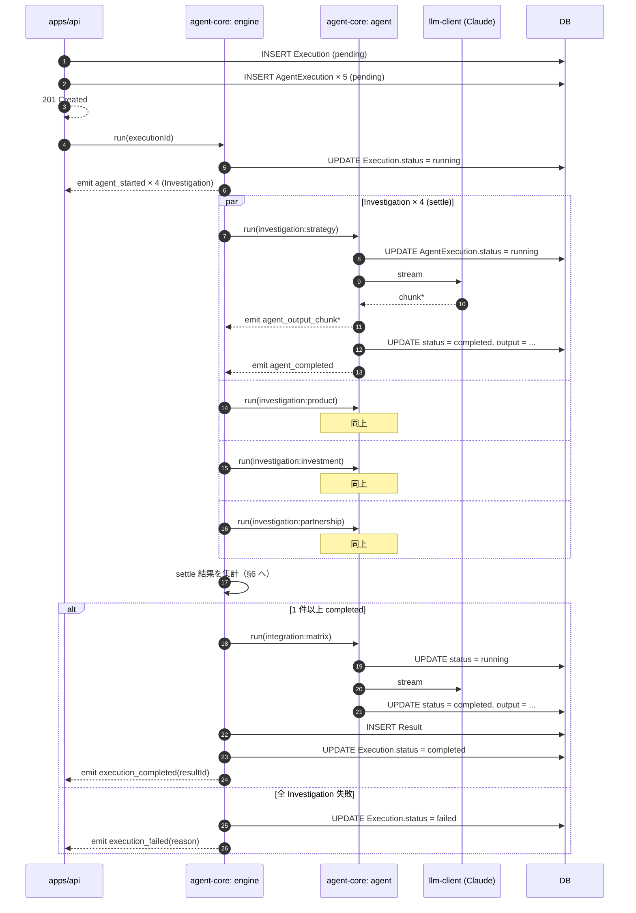

# エージェント実行アーキテクチャ

複数エージェントの並列実行・統合エージェントへの受け渡し・進捗イベント発行・失敗/タイムアウトの設計方針。`packages/agent-core/` の実装根拠となる。

## 1. 本ドキュメントの位置付け

本ドキュメントは `packages/agent-core/src/engine.ts`（チーム実行制御）の設計方針を定める。前提:

- [ADR-0005 MVP スコープ](../adr/0005-mvp-scope.md)（MVP Hero UC・30 分以内の制約）
- [ADR-0009 アーキテクチャ](../adr/0009-architecture.md)（agent-core パッケージ構成）
- [llm-integration.md](./llm-integration.md)（呼び出し構造・障害隔離方針・SDK リトライ）
- [data-model.md](./data-model.md)（Execution / AgentExecution / Result の状態遷移）
- [templates/competitor-analysis.md](./templates/competitor-analysis.md)（Investigation / Integration の I/O スキーマ）

### 責務分担

他ドキュメントとの役割分担を明示する。本 doc は重複を持たず、参照リンクで接続する。

| トピック | SSoT |
| --- | --- |
| ユーザー視点の進捗表示・失敗時 UX | [docs/product/templates/competitor-analysis.md](../product/templates/competitor-analysis.md) |
| LLM モデル・パラメータ・SDK リトライ・ストリーミング方式 | [llm-integration.md](./llm-integration.md) |
| エンティティ属性・状態値・JSON 出力スキーマ | [data-model.md](./data-model.md) / [templates/competitor-analysis.md](./templates/competitor-analysis.md) |
| WebSocket メッセージ最終型・接続ライフサイクル | [api-design.md](./api-design.md)（A5 [Issue #54](https://github.com/kuairen-227/agent-team-studio/issues/54) で確定） |
| 本ドキュメント | 並列実行制御・内部イベント契約・状態確定フロー・タイムアウト・cleanup 方針 |

### SSoT の原則

実装前は本ドキュメントが暫定 SSoT。実装後の SSoT 移行先は §10 を参照。

## 2. 並列実行モデル

要件は **「1 エージェントの失敗が他を巻き込まない障害隔離」**（[llm-integration.md §エージェント単位の障害隔離](./llm-integration.md) 準拠）。MVP は Investigation Agent 4 体の固定並列。

### 採用方針

settle ベースの並列実行を採用する。全 Investigation の決着（成功 or 失敗）を待ってから Integration 起動可否を判定する。実装上は ECMAScript 標準の `Promise.allSettled` 相当を想定。

### 不採用方針

| 案 | 不採用理由 |
| --- | --- |
| `Promise.all` 相当（reject 早期伝播） | 1 件失敗で全体 reject となり障害隔離要件を破る |
| 同時実行数制御ライブラリ（p-limit 等） | MVP 4 並列固定のためレート制御が不要 |
| キュー / ワーカープール | 単一 Execution 内の固定並列数に対しオーバーエンジニアリング |

Integration Agent は Investigation 全体の決着後に **直列で 1 体起動**する。

## 3. エージェント ID 命名規約

`AgentExecution.agent_id` の値の形式を以下に固定する。

### 形式

`<role>:<key>` のコロン区切り。正規表現 `^[a-z]+:[a-z_]+$`。

### MVP の値

| agent_id | role | key の意味 |
| --- | --- | --- |
| `investigation:strategy` | investigation | 戦略観点 |
| `investigation:product` | investigation | 製品観点 |
| `investigation:investment` | investigation | 投資観点 |
| `investigation:partnership` | investigation | パートナーシップ観点 |
| `integration:matrix` | integration | マトリクス統合（成果物種別） |

### 採用理由

- role と key が視覚的に分離され、人が読んでも意図が伝わる
- `AgentExecution.agent_id` / WebSocket メッセージの `agentId` / ログで同一表現を使えるため横断検索が容易
- Investigation の `key` は [templates/competitor-analysis.md](./templates/competitor-analysis.md) の `perspective_key` と機械的に合成可能（`` `investigation:${perspective_key}` ``）

### 同一 Execution 内の一意性

`AgentExecution.agent_id` は同一 Execution 内で一意（[data-model.md §3 不変条件](./data-model.md)）。本命名規約で MVP テンプレートは衝突しない。

## 4. 実行ライフサイクル

`POST /api/executions` 受理から Execution 完了までの主要シーケンス。DB 副作用とイベント発行を併記する。



### 副作用の順序

各エージェントのステータス遷移は **「DB UPDATE → イベント発行」の順**で副作用を起こす。WebSocket 配信失敗時にも DB が真の状態を保持するための優先順位。

## 5. 進捗イベント契約

agent-core 内部でエンジンが発行するイベントの契約。実装側（`apps/api`）はコールバックを注入し、これを受け取って WebSocket メッセージに写像する（依存方向は `apps/api → agent-core`、[llm-integration.md §データフロー](./llm-integration.md) 準拠）。

### 型定義（暫定 SSoT）

```typescript
// 暫定 SSoT。実装後は packages/agent-core/src/events.ts を SSoT とする。
type AgentEvent =
  | { kind: "agent_started"; agentId: string; startedAt: string }
  | { kind: "agent_output_chunk"; agentId: string; chunk: string }
  | { kind: "agent_completed"; agentId: string; completedAt: string }
  | { kind: "agent_failed"; agentId: string; reason: AgentFailReason; failedAt: string }
  | { kind: "execution_completed"; resultId: string }
  | { kind: "execution_failed"; reason: ExecutionFailReason };

type AgentFailReason =
  | "llm_error"          // SDK リトライ後も失敗
  | "output_parse_error" // 出力 JSON パース失敗
  | "timeout";           // §7 のいずれか

type ExecutionFailReason =
  | "all_investigations_failed"
  | "integration_failed"
  | "timeout";
```

`startedAt` / `completedAt` / `failedAt` は ISO 8601 文字列。実装で `Date` を使うか文字列を使うかは agent-core 実装時に決定。

### 発行タイミング

| イベント | 発行点 |
| --- | --- |
| `agent_started` | `AgentExecution.status = running` UPDATE 直後 |
| `agent_output_chunk` | LLM SDK の `content_block_delta` 受信ごと |
| `agent_completed` | 出力パース成功・`AgentExecution.status = completed` UPDATE 直後 |
| `agent_failed` | 失敗判定・`AgentExecution.status = failed` UPDATE 直後 |
| `execution_completed` | Result INSERT・`Execution.status = completed` UPDATE 直後 |
| `execution_failed` | `Execution.status = failed` UPDATE 直後 |

### A5 への引き継ぎ

WebSocket メッセージの最終型・接続ライフサイクル・再接続ポリシーは A5 [Issue #54](https://github.com/kuairen-227/agent-team-studio/issues/54) で確定する。本イベントを以下のように WS 型へ写像する想定だが、最終確定は A5 に委ねる。

| AgentEvent | 既存 [api-design.md](./api-design.md) の WsMessage |
| --- | --- |
| `agent_started` / `agent_completed` / `agent_failed` | `agent:status` |
| `agent_output_chunk` | `agent:output` |
| `execution_completed` | `execution:completed` |
| `execution_failed` | `execution:error` |

## 6. エラーハンドリングと状態確定

[data-model.md §5.3](./data-model.md) の選択肢から **候補 A**（`completed` / `failed` の 2 値、欠落観点は `Result.structured.missing` で表現）を採用する。UX 側の見せ方は [docs/product/templates/competitor-analysis.md §失敗時のふるまい](../product/templates/competitor-analysis.md) を参照。

### 状態確定フロー

```mermaid
flowchart TD
    Start([全 Investigation settle]) --> Count{completed の数}
    Count -->|0 件| AllFail[Execution.status = failed<br/>error_message = all_investigations_failed]
    AllFail --> EmitFail1[emit execution_failed]
    EmitFail1 --> End1([End])

    Count -->|1 件以上| RunInt[Integration Agent 起動]
    RunInt --> IntResult{Integration 結果}

    IntResult -->|completed| BuildResult[Result.structured を組み立て<br/>失敗観点は missing[] に追記]
    BuildResult --> InsertResult[INSERT Result]
    InsertResult --> ExecOk[Execution.status = completed]
    ExecOk --> EmitOk[emit execution_completed]
    EmitOk --> End2([End])

    IntResult -->|failed| IntFail[Execution.status = failed<br/>error_message = integration_failed]
    IntFail --> EmitFail2[emit execution_failed]
    EmitFail2 --> End3([End])
```

### ケース別のデータ確定

| ケース | Execution.status | Result | `Result.structured.missing[]` |
| --- | --- | --- | --- |
| 全 Investigation 成功 + Integration 成功 | `completed` | 作成 | 空配列 |
| 部分 Investigation 失敗 + Integration 成功 | `completed` | 作成 | 失敗観点を `{ perspective, reason: "agent_failed" }` で追記 |
| 全 Investigation 失敗 | `failed`（`error_message: "all_investigations_failed"`） | 未作成 | — |
| Integration のみ失敗 | `failed`（`error_message: "integration_failed"`） | 未作成 | — |

### Integration 失敗時の個別 Investigation 結果の保持

Integration が失敗した場合も、個別 Investigation の `output` は `AgentExecution.output` に残る（[data-model.md §3 不変条件](./data-model.md) で `completed` 時に保持）。Result は作成されないが、UI 側は Execution 配下の AgentExecution を辿って個別結果を表示できる（[US-4 受入基準](../product/user-stories.md#us-4-統合結果を閲覧しエクスポートする)）。

### `missing[].reason` の使い分け

- `agent_failed` — Investigation Agent 自体が失敗（`AgentEvent.agent_failed` を発行した観点）
- `insufficient_evidence` — Agent は成功したが全 findings が `evidence_level: insufficient`（[templates/competitor-analysis.md §失敗観点の表現ルール](./templates/competitor-analysis.md) 参照）

## 7. タイムアウト方針

[ADR-0005 MVP スコープ](../adr/0005-mvp-scope.md) の「30 分以内」制約から逆算する 3 階層のタイムアウト。

| 階層 | 値 | 根拠 |
| --- | --- | --- |
| LLM 呼び出し単体 | 120 秒 | SDK 側タイムアウト。リトライ 3 回（[llm-integration.md §リトライ設定](./llm-integration.md)）込みで最大 ~7 分 |
| エージェント単位（engine ラップ） | 300 秒（5 分） | リトライ込み上限。超過時は LLM 呼び出しをキャンセル |
| Execution 全体 | 1500 秒（25 分） | MVP 30 分制約に対し 5 分のバッファ。超過時は実行中の全エージェントをキャンセル |

### 超過時のふるまい

- エージェント単位タイムアウト → 当該 `AgentExecution.status = failed`、`AgentEvent.agent_failed`（`reason: "timeout"`）
- Execution 全体タイムアウト → 残実行を全停止、`Execution.status = failed`、`AgentEvent.execution_failed`（`reason: "timeout"`）

### 値の SSoT

MVP 段階は本ドキュメントが暫定 SSoT。実装先ヒントとして `packages/agent-core/src/constants.ts` を想定。**実装後は同コードが SSoT、本節はコード参照に移行する**。Template.definition への埋め込み（テンプレートごとに個別値を持つ）は v2 以降。

## 8. キャンセルの実装範囲

`POST /api/executions/:id/cancel`（ユーザー起点のキャンセル）は MVP スコープ外（[ADR-0005 MVP スコープ](../adr/0005-mvp-scope.md)）。

ただし §7 の Execution 全体タイムアウト時、実行中の LLM 呼び出しを中断して子リソースを解放する **cleanup メカニズム**は engine が保持する必要がある。Web 標準の abort 伝播相当（`AbortController` / `AbortSignal`）の利用を想定するが、具体実装は agent-core 実装時に決定する。

タイムアウト経由でキャンセルされた `running` レコードは、いずれも `failed` + 適切な `error_message`（`reason: "timeout"`）で閉じる。

## 9. 関連ドキュメント

- [llm-integration.md](./llm-integration.md) — モデル・パラメータ・SDK リトライ・障害隔離
- [data-model.md](./data-model.md) — Execution / AgentExecution / Result の状態遷移
- [templates/competitor-analysis.md](./templates/competitor-analysis.md) — Investigation / Integration の I/O スキーマ・`missing[]` の意味
- [api-design.md](./api-design.md) — REST / WebSocket（A5 で本 doc のイベントから写像）
- [docs/product/user-stories.md](../product/user-stories.md) — US-3 / US-4 受入基準
- [docs/product/templates/competitor-analysis.md](../product/templates/competitor-analysis.md) — 失敗時 UX
- [ADR-0005 MVP スコープ](../adr/0005-mvp-scope.md) / [ADR-0009 アーキテクチャ](../adr/0009-architecture.md)

## 10. 実装後の SSoT 移行先

実装着手後、本ドキュメントの該当節は以下のコード参照に書き換える。

| 節 | 暫定 SSoT としての定義 | 実装後の SSoT 移行先（想定） |
| --- | --- | --- |
| §3 エージェント ID | ID 値・正規表現 | `packages/shared/src/agent-ids.ts` |
| §5 進捗イベント | `AgentEvent` 型定義 | `packages/agent-core/src/events.ts` |
| §7 タイムアウト値 | 秒数の暫定値 | `packages/agent-core/src/constants.ts` |
