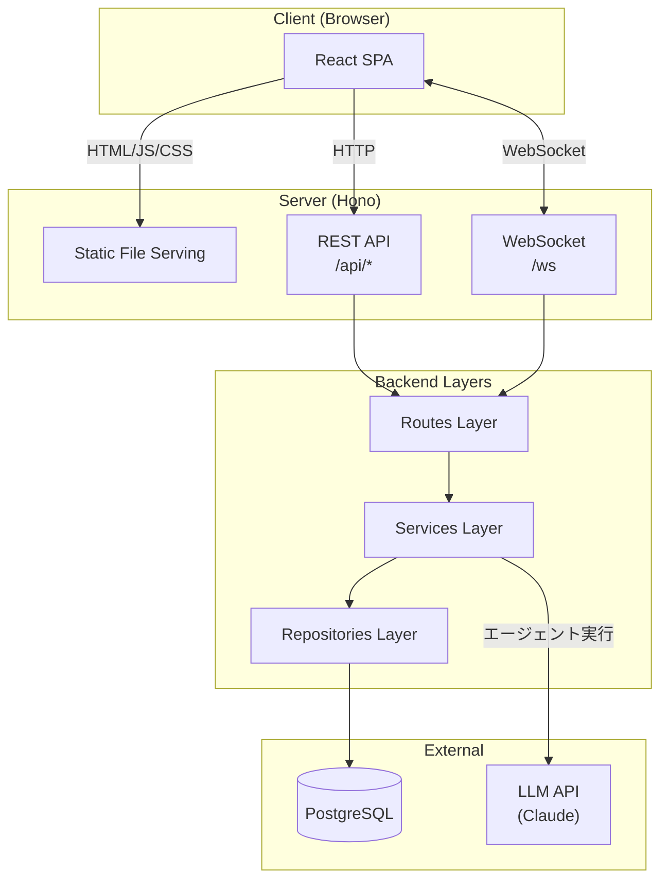
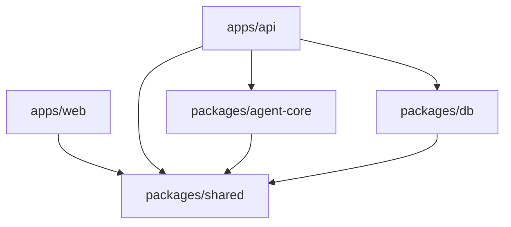

# アーキテクチャ概要

ADR-0008（技術スタック）、ADR-0009（アーキテクチャ方針）で決定した内容のリファレンス。

## 全体アーキテクチャ



- **React SPA**: UI レンダリング、クライアント状態管理、WebSocket クライアント
- **Hono**: REST API、WebSocket サーバー、エージェント実行制御、SPA 静的ファイル配信
- 本番は 1 プロセスで完結。開発時は Vite dev server + Hono dev server を並行起動し、Vite のプロキシで `/api/*` と `/ws` を Hono に転送

## モノレポ構成

```bash
agent-team-studio/
├── apps/
│   ├── web/              # React + Vite (SPA)
│   └── api/              # Hono — API + WebSocket + SPA 配信
├── packages/
│   ├── shared/           # フロント・バックエンド共有の型定義
│   ├── agent-core/       # エージェント実行エンジン
│   └── db/               # Drizzle スキーマ・マイグレーション
├── package.json          # ルート（workspace 定義）
├── tsconfig.base.json
├── biome.json
└── turbo.json
```

### パッケージ間の依存方向



依存は常に apps → packages、packages → packages の一方向。循環依存は禁止。

## バックエンド（apps/api）

レイヤードアーキテクチャ（routes → services → repositories）を採用。repositories は [packages/db](#データベースpackagesdb) 配下に配置する（[ADR-0023](../adr/0023-repository-layer-placement.md)）。

```bash
apps/api/src/
├── routes/              # HTTP/WS ハンドラ（入出力の変換）
│   ├── executions.ts
│   ├── templates.ts
│   └── ws.ts
├── services/            # ビジネスロジック
│   ├── execution.service.ts
│   └── template.service.ts
└── index.ts             # Hono app 組み立て・起動
```

| レイヤー | 責務 | 依存先 |
| --- | --- | --- |
| Routes | HTTP/WebSocket リクエストの受信、バリデーション、レスポンス整形 | Services |
| Services | ビジネスロジック、エージェント実行の制御、トランザクション管理 | Repositories, agent-core |
| Repositories | Drizzle 経由のデータアクセス、SQL の構築と実行 | DB client (Drizzle) |

## フロントエンド（apps/web）

Feature-based 構成を採用。機能単位でコンポーネント・hooks・型をまとめる。

```bash
apps/web/src/
├── features/
│   ├── template-select/     # テンプレート選択画面
│   │   ├── components/
│   │   ├── hooks/
│   │   └── index.ts
│   ├── execution/           # 実行・リアルタイム進捗表示
│   │   ├── components/
│   │   ├── hooks/
│   │   └── index.ts
│   └── history/             # 実行履歴
│       ├── components/
│       ├── hooks/
│       └── index.ts
├── components/              # 共通 UI コンポーネント（shadcn/ui）
├── lib/                     # ユーティリティ（API クライアント等）
├── App.tsx
└── main.tsx
```

複数 feature で使うコンポーネントは `components/` に昇格させる。

## 共有パッケージ（packages/shared）

フロント・バックエンド間の型定義を一元管理する。

```bash
packages/shared/src/
├── api-types.ts         # REST API のリクエスト・レスポンス型
├── ws-types.ts          # WebSocket メッセージ型
├── domain-types.ts      # ドメインモデルの型（Template, Execution 等）
└── index.ts
```

## エージェント実行エンジン（packages/agent-core）

```bash
packages/agent-core/src/
├── engine.ts            # エージェントチームの実行制御
├── agent.ts             # 個別エージェントの実行
├── llm-client.ts        # LLM API クライアント
└── index.ts
```

## データベース（packages/db）

インフラ層パッケージ。Drizzle スキーマ・DB 接続・データアクセス関数（repositories）の 3 要素を持つ（[ADR-0023](../adr/0023-repository-layer-placement.md)）。

```bash
packages/db/
├── src/
│   ├── schema/          # テーブル定義
│   │   ├── templates.ts
│   │   ├── executions.ts
│   │   └── index.ts
│   ├── repositories/    # データアクセス関数（Drizzle 経由）
│   ├── client.ts        # DB 接続
│   └── index.ts
├── drizzle/             # マイグレーションファイル（自動生成）
└── drizzle.config.ts
```

## サーバー構成

### 本番

Hono が Vite のビルド成果物（静的ファイル）を配信。サーバーは 1 プロセスで完結。

```text
Browser → Hono ─┬─ /           → 静的ファイル（React SPA）
                 ├─ /api/*     → REST API
                 └─ /ws        → WebSocket
```

### 開発

Vite dev server と Hono dev server を並行起動。Vite のプロキシ機能で API リクエストを Hono に転送。

```text
Browser → Vite dev server ─┬─ /           → HMR 付き React
                            ├─ /api/*     → proxy → Hono dev server
                            └─ /ws        → proxy → Hono dev server
```
