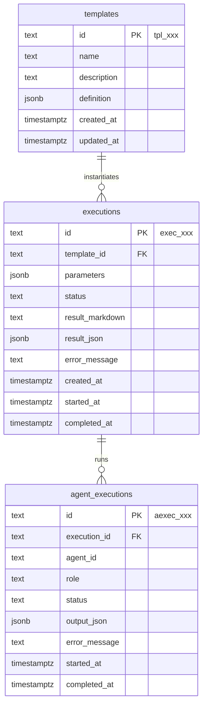
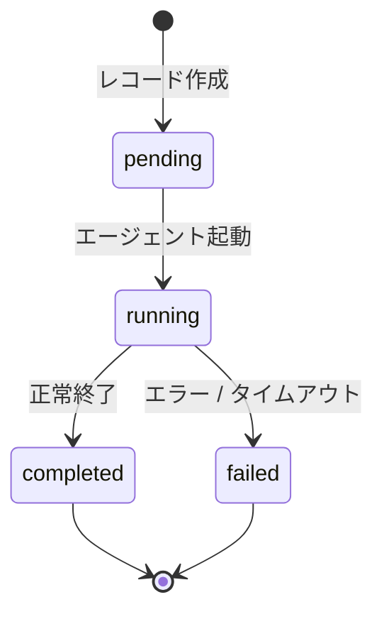
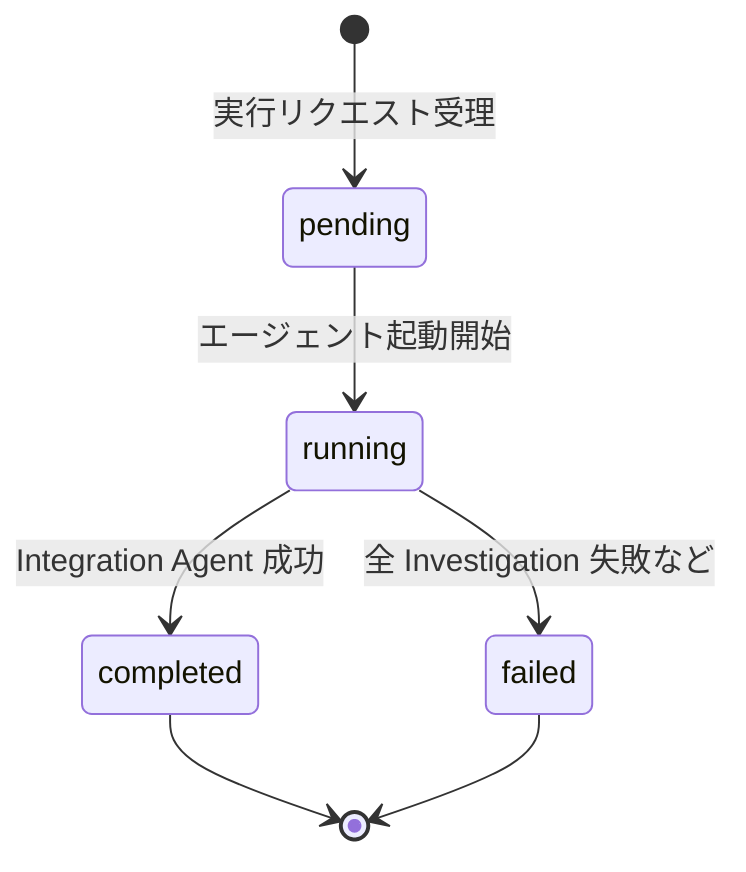

# データモデル設計

MVP のデータモデル。テンプレート・実行・エージェント実行の各エンティティと、JSONB 構造・状態遷移・物理スキーマ表記方針を定義する。

本 doc の位置付け:

- **対象範囲**: 論理データモデル（エンティティ・属性・関係・状態遷移）と、DBMS（PostgreSQL）レベルの物理スキーマ表記方針
- **対象外**: ORM（Drizzle）固有の API 表記・マイグレーションファイル・シードデータ実体。これらは MVP 実装 Issue で `packages/db/` 配下に具体化する

前提 ADR / ドキュメント:

- [ADR-0005 MVP スコープ](../adr/0005-mvp-scope.md)（テンプレート概念モデル・Hero UC）
- [ADR-0008 技術スタック](../adr/0008-tech-stack.md)（PostgreSQL / Drizzle）
- [ADR-0009 アーキテクチャ](../adr/0009-architecture.md)（レイヤー構成・パッケージ依存）
- [architecture.md](./architecture.md)（`packages/db` / `packages/shared` の配置）
- [api-design.md](./api-design.md)（ID 形式 `exec_xxx` / `tpl_xxx` の慣例）
- [llm-integration.md](./llm-integration.md)（ストリーミング中断時は部分出力を保存しない）
- [templates/competitor-analysis.md](./templates/competitor-analysis.md)（テンプレート固有の I/O スキーマ）

## 1. エンティティと関係

MVP のデータモデルは 3 エンティティで構成する。



**関係**:

- `templates : executions` = 1 : N（削除制限。テンプレートを削除すると紐づく実行履歴が孤立するため `ON DELETE RESTRICT`）
- `executions : agent_executions` = 1 : N（親の実行削除時に連鎖削除 `ON DELETE CASCADE`）

**MVP では独立の `results` テーブルを作らない**。Integration Agent の最終成果物は `executions.result_markdown` / `executions.result_json` に、個別 Investigation Agent の出力は `agent_executions.output_json` に格納する（[§7 主要な設計判断](#7-主要な設計判断) 参照）。

## 2. エンティティ属性

### 2.1 templates

| カラム | 型 | NULL | 説明 |
| --- | --- | --- | --- |
| `id` | TEXT | NOT NULL (PK) | `tpl_` プレフィックス付き文字列 |
| `name` | TEXT | NOT NULL | ユーザー向け表示名（例: 競合調査） |
| `description` | TEXT | NOT NULL | テンプレートの説明 |
| `definition` | JSONB | NOT NULL | テンプレート定義本体（§4 参照） |
| `created_at` | TIMESTAMPTZ | NOT NULL | |
| `updated_at` | TIMESTAMPTZ | NOT NULL | |

- MVP はシードテンプレート（競合調査）1 件のみ。ユーザー作成・編集は v2（[ADR-0005](../adr/0005-mvp-scope.md)）

### 2.2 executions

| カラム | 型 | NULL | 説明 |
| --- | --- | --- | --- |
| `id` | TEXT | NOT NULL (PK) | `exec_` プレフィックス付き文字列 |
| `template_id` | TEXT | NOT NULL (FK → templates.id) | 紐づくテンプレート |
| `parameters` | JSONB | NOT NULL | テンプレート固有の入力パラメータ（§5.1 参照） |
| `status` | TEXT (enum) | NOT NULL | `pending` \| `running` \| `completed` \| `failed`（§3 参照） |
| `result_markdown` | TEXT | NULL | Integration Agent の最終 Markdown 出力。未完了・失敗時は NULL |
| `result_json` | JSONB | NULL | Integration Agent の内部 JSON（§5.2 参照）。未完了・失敗時は NULL |
| `error_message` | TEXT | NULL | 実行全体の失敗理由（全エージェント失敗時など） |
| `created_at` | TIMESTAMPTZ | NOT NULL | 実行レコード作成時刻（`pending` 開始時刻） |
| `started_at` | TIMESTAMPTZ | NULL | エージェント実行開始時刻 |
| `completed_at` | TIMESTAMPTZ | NULL | 実行終了時刻（completed / failed 到達時） |

**インデックス**:

- `(template_id, created_at DESC)` — 履歴一覧（[US-5](../product/user-stories.md#us-5-過去の実行履歴を振り返る)）を新しい順に取得

### 2.3 agent_executions

| カラム | 型 | NULL | 説明 |
| --- | --- | --- | --- |
| `id` | TEXT | NOT NULL (PK) | `aexec_` プレフィックス付き文字列 |
| `execution_id` | TEXT | NOT NULL (FK → executions.id) | 親の実行 |
| `agent_id` | TEXT | NOT NULL | テンプレート定義で付与されたエージェント識別子。命名規約は A4 で確定 |
| `role` | TEXT (enum) | NOT NULL | `investigation` \| `integration` |
| `status` | TEXT (enum) | NOT NULL | `pending` \| `running` \| `completed` \| `failed`（§3 参照） |
| `output_json` | JSONB | NULL | 当該エージェントの最終出力 JSON（§6 参照）。未完了・失敗時は NULL |
| `error_message` | TEXT | NULL | 当該エージェント固有の失敗理由 |
| `started_at` | TIMESTAMPTZ | NULL | エージェント実行開始時刻 |
| `completed_at` | TIMESTAMPTZ | NULL | 当該エージェント終了時刻 |

**制約**:

- `UNIQUE (execution_id, agent_id)` — 同一実行内で同じ `agent_id` のレコードは 1 件のみ
- **インデックス**: `(execution_id)` — 実行画面で全エージェントをまとめて取得

## 3. 状態遷移

### 3.1 エージェント実行（agent_executions.status）



- `pending`: 親 Execution 開始時に全エージェント分を一括挿入
- `running`: エージェントの LLM 呼び出し開始
- `completed`: LLM ストリーミング完了・出力 JSON パース成功
- `failed`: LLM 呼び出し失敗・出力 JSON パース失敗・タイムアウトのいずれか（[llm-integration.md §ストリーミング方式](./llm-integration.md) 参照。部分出力は保存せず、`output_json` は NULL）

### 3.2 実行全体（executions.status）



- `pending`: `POST /api/executions` 受理直後。親レコードと全 `agent_executions` 行を作成
- `running`: いずれかのエージェントが `running` または `completed` に達した時点
- `completed`: Integration Agent が `completed` に到達し、`result_markdown` / `result_json` が保存された状態
- `failed`: 全 Investigation Agent が `failed` となり Integration Agent を起動できない場合。`error_message` に要因を記録

### 3.3 部分失敗の扱い（A4 への申し送り）

以下は **A4 エージェント実行アーキテクチャ（[Issue #53](https://github.com/kuairen-227/agent-team-studio/issues/53)）で確定** する。本 doc では選択肢を提示するに留める:

| ケース | 候補 A | 候補 B |
| --- | --- | --- |
| 一部 Investigation 失敗・Integration 成功 | `completed`（部分失敗は `result_json.missing` で表現） | 新ステータス `partial_failure` を追加 |
| Integration Agent のみ失敗 | `failed` | `completed`（個別 `agent_executions.output_json` を結果画面に表示、[US-4](../product/user-stories.md#us-4-統合結果を閲覧しエクスポートする) 整合） |

現時点では **候補 A（`completed` と `failed` の 2 値に集約し、詳細は `result_json.missing` と `agent_executions` で表現）** を推定採用としてスキーマを設計している。A4 で `partial_failure` を追加する判断になった場合は enum 拡張のみで対応可能。

## 4. Template.definition の構造

`templates.definition` は JSONB で、テンプレート全体の静的定義を格納する。TypeScript 型として以下を想定する（実装時は `packages/shared/src/domain-types.ts` に配置）:

```typescript
type TemplateDefinition = {
  schema_version: "1"; // 将来のスキーマ進化に備える。§7.3 参照
  input_schema: JsonSchema; // 入力パラメータの JSON Schema
  agents: AgentDefinition[]; // テンプレートを構成するエージェント定義
  llm: LlmDefaults; // このテンプレートのデフォルト LLM 呼び出し設定
};

type AgentDefinition =
  | InvestigationAgentDefinition
  | IntegrationAgentDefinition;

type InvestigationAgentDefinition = {
  role: "investigation";
  agent_id: string; // A4 で確定する命名規約に従う文字列
  specialization: {
    perspective_key: string; // "strategy" | "product" | "investment" | "partnership"
    perspective_name_ja: string; // UI 表示ラベル
    perspective_description: string; // プロンプトへ差し込む観点の説明
  };
  system_prompt_template: string; // {{var}} 形式のテンプレート文字列
};

type IntegrationAgentDefinition = {
  role: "integration";
  agent_id: string; // A4 で確定する命名規約に従う文字列
  system_prompt_template: string;
};

type LlmDefaults = {
  // llm-integration.md で確定した値をテンプレート単位で保持
  model: string; // 例: "claude-sonnet-4-6"
  temperature_by_role: { investigation: number; integration: number };
  max_tokens_by_role: { investigation: number; integration: number };
};
```

### 4.1 テンプレート置換方式

`system_prompt_template` 内の `{{name}}` を実行時に実値で置換する単純置換方式。置換変数:

| 変数 | 値の出所 |
| --- | --- |
| `{{competitors}}` | `executions.parameters.competitors` を整形した文字列 |
| `{{reference_or_empty}}` | `executions.parameters.reference` または空文字 |
| `{{perspective_name_ja}}` | Investigation Agent の `specialization.perspective_name_ja` |
| `{{perspective_description}}` | Investigation Agent の `specialization.perspective_description` |
| `{{perspective_key}}` | Investigation Agent の `specialization.perspective_key` |
| `{{investigation_results}}` | 全 Investigation Agent の `output_json` を整形した文字列配列 |

未定義変数が `system_prompt_template` に現れた場合はテンプレート読み込み時（実装側のシード投入時）にバリデーションエラーとする方針。具体的なバリデーション実装は MVP 実装 Issue で決める。

### 4.2 出力スキーマの配置

個別エージェントの出力 JSON Schema（Investigation Agent の `{perspective, findings[]}` 等）は `definition` 内に持たず、**テンプレート固有の型として `packages/shared/src/domain-types.ts` にコード定義する**。理由:

- 出力構造を JSONB で動的に持っても、実装側で parse / 型付けする先はコードのため二重管理になる
- MVP はシードテンプレート 1 本で、出力構造はコードにハードコードしても運用負荷がない
- テンプレートのユーザー作成対応（v2）時に、ここを `definition` に移行する判断をすれば良い

シードテンプレートの具体値（システムプロンプト本文・観点の意味づけ）は [`docs/product/templates/competitor-analysis.md`](../product/templates/competitor-analysis.md) と [`docs/design/templates/competitor-analysis.md`](./templates/competitor-analysis.md) を参照。

## 5. executions の JSONB / TEXT 構造

### 5.1 executions.parameters

テンプレート固有の入力。競合調査テンプレートの場合は [`CompetitorAnalysisParameters`](./templates/competitor-analysis.md#入力パラメータ-json-schema) 型と一致する。

```typescript
type CompetitorAnalysisParameters = {
  competitors: string[]; // 1〜5 件、各 1〜100 文字
  reference?: string; // 任意、最大 10,000 文字
};
```

観点リストは MVP では API 入力として受け付けず、実行時にテンプレート定義側の固定 4 観点を付与する（[ADR-0005](../adr/0005-mvp-scope.md) Non-goals: テンプレート編集）。

### 5.2 executions.result_markdown / result_json

Integration Agent の最終成果物。Integration Agent が `completed` に到達したタイミングで両カラムを更新する。

- `result_markdown`: [`docs/product/templates/competitor-analysis.md`](../product/templates/competitor-analysis.md) で定義した Markdown レポート（観点×競合マトリクス＋全体所見）。エクスポート（[US-4](../product/user-stories.md#us-4-統合結果を閲覧しエクスポートする)）はこのカラムをそのまま返す
- `result_json`: Integration Agent の内部保持用 JSON

```typescript
type CompetitorAnalysisResult = {
  matrix: Array<{
    perspective: "strategy" | "product" | "investment" | "partnership";
    cells: Array<{
      competitor: string;
      summary: string;
      source_evidence_level: "strong" | "moderate" | "weak" | "insufficient";
    }>;
  }>;
  overall_insights: string[];
  missing: Array<{
    perspective: "strategy" | "product" | "investment" | "partnership";
    reason: "agent_failed" | "insufficient_evidence";
  }>;
};
```

型の詳細な制約（`matrix[].perspective` の一意性など）は [`docs/design/templates/competitor-analysis.md §失敗観点の表現ルール`](./templates/competitor-analysis.md#失敗観点の表現ルール) を参照。

## 6. agent_executions.output_json の構造

エージェントの `role` により保持するスキーマが異なる。TypeScript 型として:

```typescript
type AgentOutputJson =
  | InvestigationOutput // role: "investigation"
  | IntegrationOutput; // role: "integration"

type InvestigationOutput = {
  perspective: "strategy" | "product" | "investment" | "partnership";
  findings: Array<{
    competitor: string;
    points: string[];
    evidence_level: "strong" | "moderate" | "weak" | "insufficient";
    notes?: string;
  }>;
};

type IntegrationOutput = CompetitorAnalysisResult; // §5.2 と同型
```

Integration Agent の出力は `executions.result_json` と同じ構造のため重複するが、以下の理由で `agent_executions` にも保持する:

- Integration Agent 失敗時でも個別 Investigation Agent の出力を結果画面で閲覧したい（[US-4](../product/user-stories.md#us-4-統合結果を閲覧しエクスポートする) 受入基準）
- 実行トレース観点で、どのエージェントが何を出力したかを個別に追跡できる

**部分出力は保存しない**。ストリーミング中のエラー時は `output_json = NULL` のまま `status = failed` とする（[llm-integration.md §ストリーミング方式](./llm-integration.md) 方針と整合）。

## 7. 主要な設計判断

### 7.1 エージェント単位の状態を別テーブル化（agent_executions）

**採用**: 独立テーブル `agent_executions`

| 観点 | 独立テーブル（採用） | Execution.agents JSONB（却下） |
| --- | --- | --- |
| 部分更新 | 1 行 UPDATE で済む | JSONB 全置換が必要 |
| 個別エージェント出力の保存 | `output_json` カラムに自然に格納 | JSONB 内入れ子で管理が複雑 |
| 個別クエリ（特定ステータスのエージェント絞り込み等） | SQL で直接可能 | JSONB 関数が必要 |
| トレードオフ | テーブル数が増える | スキーマ変更時に `definition` と同期が必要 |

US-3 のステータス表示と US-4 の Integration 失敗時の個別結果閲覧の両方を無理なくサポートするため、独立テーブル案を採用。

### 7.2 独立 results テーブルを作らない

**採用**: 最終成果物は `executions.result_markdown` / `result_json`、個別出力は `agent_executions.output_json`

- MVP は 1 Execution につき最終 Result 1 件で 1 : 1 関係。別テーブル化の正規化メリットが薄い
- 実行再試行・バージョン管理は MVP スコープ外（[ADR-0005](../adr/0005-mvp-scope.md) Non-goals）
- 将来、同一実行に対する再統合や結果の版管理が必要になった時点で `results` テーブルを切り出す

### 7.3 Template.definition のバージョン管理キー

**採用**: `definition.schema_version` を JSON 内に持つ。テーブルレベルの `templates.version` は設けない

- プロンプト改訂履歴は git で管理（シードデータのマイグレーション／シードスクリプトで反映）
- 将来、`TemplateDefinition` スキーマが進化した際に `schema_version` によるマイグレーションロジックを書ける
- ユーザーによるテンプレート作成・編集は v2 のため、レコード単位のバージョニングは不要

### 7.4 executions.parameters は JSONB でテンプレート横断

**採用**: `parameters` を JSONB とし、テンプレートごとに異なる入力を格納

- テンプレート固有のカラムを追加するとテンプレート増加時にスキーマ変更が必要
- 入力バリデーションは `templates.definition.input_schema`（JSON Schema）で実行時に検証
- `reference`（最大 10,000 文字）は `parameters` 内に inline で保持。別テーブル化のメリットなし

## 8. 物理スキーマ表記方針

ORM 中立の命名・型マッピング規約。Drizzle 等の ORM 固有 API（型付け・リレーション宣言）は実装時に本方針に従って `packages/db/src/schema/` 配下で具体化する。

**DBMS**: PostgreSQL（[ADR-0008](../adr/0008-tech-stack.md)）

**ファイル分割**（[architecture.md](./architecture.md) 準拠）:

```text
packages/db/src/schema/
├── templates.ts
├── executions.ts
├── agent-executions.ts
└── index.ts        // 各 schema の re-export とリレーション宣言
```

**テーブル / カラム命名**: snake_case（`templates`, `agent_executions`, `created_at`, `result_markdown`）

**ID 型**:

- 主キーは TEXT。プレフィックス付き文字列（`tpl_` / `exec_` / `aexec_`）で人間可読性を確保
- ID 生成はアプリ層（[api-design.md](./api-design.md) の `exec_abc123` 慣例と整合）。DB 側に `DEFAULT` は付けない

**日時**: 全カラム `TIMESTAMP WITH TIME ZONE`（`TIMESTAMPTZ`）。命名は `created_at` / `started_at` / `completed_at` / `updated_at` に統一

**列挙値（status / role）**:

- PostgreSQL の列挙型（`CREATE TYPE ... AS ENUM`）または TEXT + CHECK 制約のいずれか
- ORM のマイグレーション容易性を優先して実装時に選択する（本 doc ではどちらでもよい）

**構造化データ（JSONB）**:

- JSON は常に `JSONB`（バイナリ形式）を使用。`JSON` 型は使わない
- TypeScript 型定義は `packages/shared/src/domain-types.ts` に配置し、ORM 層で JSONB カラムに型付けする。型付け API の選定は実装時

**リレーション / 外部キー**:

- 親子関係は DB レベルで `REFERENCES` 外部キーを定義する
- `executions.template_id` → `templates.id`: `ON DELETE RESTRICT`（履歴保護）
- `agent_executions.execution_id` → `executions.id`: `ON DELETE CASCADE`（実行削除時は子も削除）
- ORM レイヤーのリレーション表記（例: 宣言的な `relations()`）は本 doc の対象外

**NULL の扱い**:

- `result_markdown` / `result_json` / `output_json` / `error_message` / `started_at` / `completed_at` は実行の進行に応じて値が確定するため NULL 許容
- `parameters` / `status` / `agent_id` / `role` は作成時に確定するため NOT NULL

**インデックス**:

- `executions(template_id, created_at DESC)` — 履歴一覧用
- `agent_executions(execution_id)` — 実行画面用（外部キーに自動付与されないケースに備え明示）

## 9. 未確定事項（後続 Issue で確定）

| 項目 | 確定先 |
| --- | --- |
| 部分失敗時の `executions.status` を `completed` / `failed` の 2 値に集約するか `partial_failure` を追加するか | A4（[Issue #53](https://github.com/kuairen-227/agent-team-studio/issues/53)） |
| Integration Agent のみ失敗時の `executions.status` | A4 |
| `agent_id` 命名規約の最終形（`investigation:<perspective>` / `integration:<artifact>` 形式で確定するか） | A4 |
| エージェント実行タイムアウト値の保存場所（テンプレート定義内 / 環境変数 / ハードコード） | A4 |
| WebSocket メッセージと `agent_executions.status` 遷移の対応 | A5（[Issue #54](https://github.com/kuairen-227/agent-team-studio/issues/54)） |
| Drizzle スキーマの具体表記（`pgEnum` / JSONB 型付け API 等） | MVP 実装 Issue（`packages/db` の実装時） |

## 関連ドキュメント

- [templates/competitor-analysis.md](./templates/competitor-analysis.md)（テンプレート固有の I/O スキーマ）
- [product/templates/competitor-analysis.md](../product/templates/competitor-analysis.md)（プロダクト視点の仕様）
- [api-design.md](./api-design.md)
- [llm-integration.md](./llm-integration.md)
- [architecture.md](./architecture.md)
- [ADR-0005 MVP スコープ](../adr/0005-mvp-scope.md)
- [ADR-0008 技術スタック](../adr/0008-tech-stack.md)
- [ADR-0009 アーキテクチャ](../adr/0009-architecture.md)
- [user-stories.md](../product/user-stories.md)（US-2 / US-3 / US-4 / US-5）
