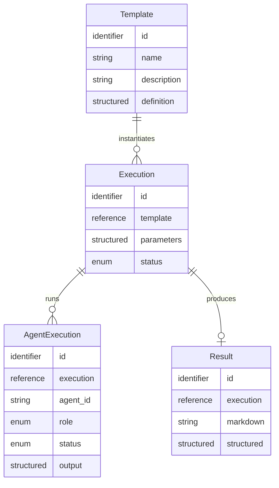
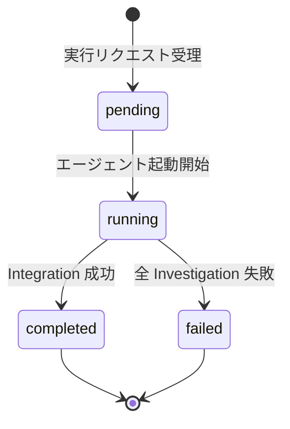

# データモデル設計

MVP のドメインモデル。エンティティ・関連・状態遷移・JSON 構造・不変条件を論理レベルで定義する。

## 1. 本ドキュメントの位置付け

本ドキュメントは **論理モデル（ドメインモデル）** を記述する。物理スキーマ（テーブル定義・型・インデックス・マイグレーション）はコード（`packages/db/src/schema/*.ts`）と `packages/db/README.md`（命名・ID 形式等の横断規約）を source of truth とし、MVP 実装 Issue で作成する。

- **本 doc の対象**: エンティティ・属性・関連・状態遷移・構造化属性（JSON）の意味論・不変条件・設計判断
- **対象外**: RDBMS 固有の型マッピング、インデックス設計、外部キーポリシー、ORM API

前提:

- [ADR-0005 MVP スコープ](../adr/0005-mvp-scope.md)（テンプレート概念モデル・Hero UC）
- [ADR-0008 技術スタック](../adr/0008-tech-stack.md) / [ADR-0009 アーキテクチャ](../adr/0009-architecture.md)
- [api-design.md](./api-design.md)（REST / WebSocket）
- [llm-integration.md](./llm-integration.md)（部分出力は保存しない方針）
- [templates/competitor-analysis.md](./templates/competitor-analysis.md)（テンプレート固有の I/O スキーマ）

## 2. エンティティと関連



**関連の意味論**:

- `Template : Execution` = 1 : N — テンプレート 1 件から複数の実行が生成される
- `Execution : AgentExecution` = 1 : N — 実行はテンプレート定義で指定された複数のエージェント実行を内包する
- `Execution : Result` = 1 : 0..1 — Integration Agent が正常完了した場合のみ Result が生成される

## 3. 不変条件

- **Result の存在条件**: Integration Agent の AgentExecution が `completed` に到達したときに限り、対応する Result が存在する
- **AgentExecution の一意性**: 同一 Execution 内で `agent_id` は一意
- **AgentExecution の出力**: `output` は `status = completed` のとき値を持ち、それ以外では未設定。部分出力は保存しない（[llm-integration.md](./llm-integration.md) 方針）

## 4. エンティティ属性

論理レベルの属性定義。データ型は論理種別で示す（`identifier` / `string` / `structured` / `enum` / `datetime` / `reference`）。

### 4.1 Template

| 属性 | 種別 | 必須 | 説明 |
| --- | --- | --- | --- |
| id | identifier | 必須 | エンティティ一意識別子 |
| name | string | 必須 | ユーザー向け表示名 |
| description | string | 必須 | テンプレートの概要 |
| definition | structured | 必須 | テンプレート定義本体（§6） |
| created_at | datetime | 必須 | |
| updated_at | datetime | 必須 | |

MVP はシードテンプレート（競合調査）1 件のみ。ユーザーによる作成・編集は v2（[ADR-0005](../adr/0005-mvp-scope.md) Non-goals）。

### 4.2 Execution

| 属性 | 種別 | 必須 | 説明 |
| --- | --- | --- | --- |
| id | identifier | 必須 | |
| template | reference(Template) | 必須 | 紐づくテンプレート |
| parameters | structured | 必須 | テンプレート固有の入力（§7） |
| status | enum | 必須 | `pending` / `running` / `completed` / `failed`（§5） |
| error_message | string | 任意 | 実行全体の失敗理由（全 Investigation 失敗時など） |
| created_at | datetime | 必須 | 実行受理時刻 |
| started_at | datetime | 任意 | エージェント実行開始時刻 |
| completed_at | datetime | 任意 | `completed` / `failed` 到達時刻 |

### 4.3 AgentExecution

| 属性 | 種別 | 必須 | 説明 |
| --- | --- | --- | --- |
| id | identifier | 必須 | |
| execution | reference(Execution) | 必須 | 親 |
| agent_id | string | 必須 | テンプレート定義側で付与された識別子。命名規約は A4 で確定 |
| role | enum | 必須 | `investigation` / `integration` |
| status | enum | 必須 | `pending` / `running` / `completed` / `failed`（§5） |
| output | structured | 任意 | 当該エージェントの最終出力（§8）。未完了・失敗時は未設定 |
| error_message | string | 任意 | 当該エージェント固有の失敗理由 |
| started_at | datetime | 任意 | |
| completed_at | datetime | 任意 | |

### 4.4 Result

| 属性 | 種別 | 必須 | 説明 |
| --- | --- | --- | --- |
| id | identifier | 必須 | |
| execution | reference(Execution) | 必須 | 対応する実行 |
| markdown | string | 必須 | Markdown レポート（エクスポート対象） |
| structured | structured | 必須 | 内部保持用の構造化表現（§7 Result） |
| created_at | datetime | 必須 | Integration Agent 完了時刻 |

## 5. 状態遷移

### 5.1 AgentExecution


- `pending`: 親 Execution 作成時に、テンプレート定義のエージェント分を一括生成
- `running`: LLM 呼び出し開始
- `completed`: ストリーミング完了かつ出力 JSON のパース成功
- `failed`: LLM 呼び出し失敗 / 出力 JSON パース失敗 / タイムアウト

### 5.2 Execution



- `pending`: `POST /api/executions` 受理直後
- `running`: いずれかの AgentExecution が `running` 以降に到達
- `completed`: Integration AgentExecution が `completed` に到達し、Result が生成された状態
- `failed`: 全 Investigation AgentExecution が `failed` で Integration を起動できない

### 5.3 部分失敗の扱い（A4 で確定）

以下は **A4 エージェント実行アーキテクチャ（[Issue #53](https://github.com/kuairen-227/agent-team-studio/issues/53)）で確定**。本 doc では選択肢のみ提示:

| ケース | 候補 A | 候補 B |
| --- | --- | --- |
| 一部 Investigation 失敗・Integration 成功 | `completed`（欠落観点は `Result.structured.missing` で表現） | 新ステータス `partial_failure` |
| Integration のみ失敗 | `failed` | `completed`（個別 AgentExecution.output を表示データとして利用） |

現在のドメインモデルは **候補 A**（`completed` / `failed` の 2 値に集約）を前提にしている。`partial_failure` 追加時は enum 拡張のみで対応可能。

## 6. Template.definition の構造

`Template.definition` はテンプレート全体の静的定義を格納する構造化属性。TypeScript 型として（実装時は `packages/shared/src/domain-types.ts` に配置）:

```typescript
type TemplateDefinition = {
  schema_version: "1"; // スキーマ進化に備える。§9.3 参照
  input_schema: JsonSchema; // Execution.parameters の JSON Schema
  agents: AgentDefinition[];
  llm: LlmDefaults;
};

type AgentDefinition =
  | {
      role: "investigation";
      agent_id: string; // A4 で確定する命名規約に従う
      specialization: {
        perspective_key: string; // "strategy" | "product" | "investment" | "partnership"
        perspective_name_ja: string;
        perspective_description: string;
      };
      system_prompt_template: string;
    }
  | {
      role: "integration";
      agent_id: string;
      system_prompt_template: string;
    };

type LlmDefaults = {
  model: string;
  temperature_by_role: { investigation: number; integration: number };
  max_tokens_by_role: { investigation: number; integration: number };
};
```

### 6.1 テンプレート置換方式

`system_prompt_template` 内の `{{name}}` を実行時に実値で置換する単純置換。置換変数:

| 変数 | 値の出所 |
| --- | --- |
| `{{competitors}}` | `Execution.parameters.competitors` を整形した文字列 |
| `{{reference_or_empty}}` | `Execution.parameters.reference` または空文字 |
| `{{perspective_name_ja}}` | Investigation の `specialization.perspective_name_ja` |
| `{{perspective_description}}` | Investigation の `specialization.perspective_description` |
| `{{perspective_key}}` | Investigation の `specialization.perspective_key` |
| `{{investigation_results}}` | 全 Investigation AgentExecution の `output` を整形した文字列配列 |

未定義変数が残った `system_prompt_template` はテンプレート読み込み時にバリデーションエラーとする（具体実装は MVP 実装 Issue）。

### 6.2 エージェント出力スキーマの配置

個別エージェントの出力スキーマ（Investigation の `{perspective, findings[]}` 等）は `definition` 内に持たず、TypeScript 型として `packages/shared/src/domain-types.ts` にコード定義する。理由:

- 出力を動的スキーマにしても、実装側で parse・型付けする先はコードのため二重管理になる
- MVP はシードテンプレート 1 本で、コード側にハードコードしても運用負荷がない
- テンプレートのユーザー作成（v2）時に `definition` への移行を判断すればよい

シードテンプレートの具体値（システムプロンプト本文・観点の意味づけ）は [`docs/product/templates/competitor-analysis.md`](../product/templates/competitor-analysis.md) と [`docs/design/templates/competitor-analysis.md`](./templates/competitor-analysis.md) を参照。

## 7. Execution.parameters / Result の構造

### 7.1 Execution.parameters

テンプレート固有の入力を保持する構造化属性。競合調査テンプレートでは `CompetitorAnalysisParameters` 型で、定義は [`templates/competitor-analysis.md §入力パラメータ JSON Schema`](./templates/competitor-analysis.md#入力パラメータ-json-schema) を参照。

観点リストは MVP では API 入力として受け付けず、テンプレート定義側の固定 4 観点を実行時に付与する（[ADR-0005](../adr/0005-mvp-scope.md) Non-goals）。

### 7.2 Result.markdown / Result.structured

Integration Agent の最終成果物。両属性は同一内容を別表現で保持する:

- `markdown`: Markdown レポート（観点×競合マトリクス＋全体所見）。[US-4](../product/user-stories.md#us-4-統合結果を閲覧しエクスポートする) のエクスポートはこの属性をそのまま返す
- `structured`: 内部保持用の構造化表現。競合調査テンプレートでは `CompetitorAnalysisResult` 型で、定義は [`templates/competitor-analysis.md §内部 JSON 出力スキーマ`](./templates/competitor-analysis.md#内部-json-出力スキーマ) を参照（失敗観点の表現ルール含む）

## 8. AgentExecution.output の構造

`output` は `role` により保持する型が異なる discriminated union:

- `role: "investigation"` → Investigation Agent の出力型
- `role: "integration"` → Integration Agent の出力型（`Result.structured` と同型）

競合調査テンプレートの具体的な型定義は [`templates/competitor-analysis.md §内部 JSON 出力スキーマ`](./templates/competitor-analysis.md#内部-json-出力スキーマ) を参照。

Integration AgentExecution の `output` と `Result.structured` は同一内容。前者は「エージェントの実行トレース」、後者は「Execution から参照される成果物」として、それぞれ独立した責務を持つ。重複は許容する（[§9.2](#92-result-を独立エンティティにする) 参照）。

**部分出力は保存しない**。ストリーミング中のエラー時は `output` 未設定のまま `status = failed` とする（[llm-integration.md](./llm-integration.md) 方針）。

## 9. 主要な設計判断

### 9.1 AgentExecution を独立エンティティにする

**採用**: AgentExecution を Execution とは独立したエンティティとして持つ

- 代案: Execution 内に構造化属性として埋め込む（`Execution.agents: AgentStatus[]`）
- 採用理由:
  - US-3 の「エージェント単位のステータス表示」で AgentExecution 単位の参照が頻繁
  - 部分更新（ストリーミング中のステータス遷移）が単一エンティティ更新で済む
  - US-4「Integration 失敗時に個別 Investigation 結果を閲覧」で個別 `output` を自然に保持できる

### 9.2 Result を独立エンティティにする

**採用**: Result を Execution とは別のエンティティとし、`Execution : Result = 1 : 0..1`

- 代案: Execution に `result_markdown` / `result_structured` を直接持たせる
- 採用理由:
  - ドメイン観点で「実行プロセス」と「成果物」は別概念であり、分離が正確
  - [US-4](../product/user-stories.md#us-4-統合結果を閲覧しエクスポートする) の Integration 失敗時の個別結果閲覧要求を、Result の不在として意味論的に自然に表現できる
  - 履歴一覧（[US-5](../product/user-stories.md#us-5-過去の実行履歴を振り返る)）で Execution のメタデータのみ取得でき、重量データ（Markdown）を伴わない
- トレードオフ:
  - エンティティ 1 本増による実装コスト（リポジトリレイヤー 1 本、関連付けのクエリ 1 本）
  - Integration 出力が Result と AgentExecution[integration].output に論理的に重複（§8）

### 9.3 Template.definition のバージョン管理キー

**採用**: `definition.schema_version` を構造化属性内で保持する。エンティティ属性としての `version` は設けない

- プロンプト改訂履歴は git で管理（シードデータのマイグレーション / シードスクリプトで反映）
- `schema_version` により `TemplateDefinition` スキーマ進化時のマイグレーションロジックが書ける
- ユーザーによるテンプレート作成・編集は v2 のため、レコード単位のバージョニングは不要

### 9.4 Execution.parameters は構造化属性でテンプレート横断

**採用**: `parameters` を構造化属性とし、テンプレート固有の入力を保持

- テンプレート固有の属性を追加する設計にするとテンプレート増加時に Execution スキーマ変更が必要
- 入力バリデーションは `Template.definition.input_schema`（JSON Schema）で実行時に検証
- `reference`（最大 10,000 文字）も `parameters` 内に inline で保持（別エンティティ化のメリットなし）

## 10. 未確定事項

本 doc では確定せず、後続で確定する:

| 項目 | 確定先 |
| --- | --- |
| 部分失敗時の `Execution.status`（§5.3） | A4（[Issue #53](https://github.com/kuairen-227/agent-team-studio/issues/53)） |
| `agent_id` 命名規約の最終形 | A4 |
| エージェント実行タイムアウト値の保存場所 | A4 |
| WebSocket メッセージと `AgentExecution.status` 遷移の対応 | A5（[Issue #54](https://github.com/kuairen-227/agent-team-studio/issues/54)） |
| 物理スキーマ（ID 形式・命名規則・型マッピング・インデックス・FK ポリシー） | MVP 実装 Issue（`packages/db/README.md` + `packages/db/src/schema/*.ts`） |

## 関連ドキュメント

- [templates/competitor-analysis.md](./templates/competitor-analysis.md)（テンプレート固有の I/O スキーマ）
- [product/templates/competitor-analysis.md](../product/templates/competitor-analysis.md)（プロダクト視点の仕様）
- [api-design.md](./api-design.md) / [llm-integration.md](./llm-integration.md) / [architecture.md](./architecture.md)
- [ADR-0005 MVP スコープ](../adr/0005-mvp-scope.md) / [ADR-0008 技術スタック](../adr/0008-tech-stack.md) / [ADR-0009 アーキテクチャ](../adr/0009-architecture.md)
- [user-stories.md](../product/user-stories.md)（US-2 / US-3 / US-4 / US-5）
