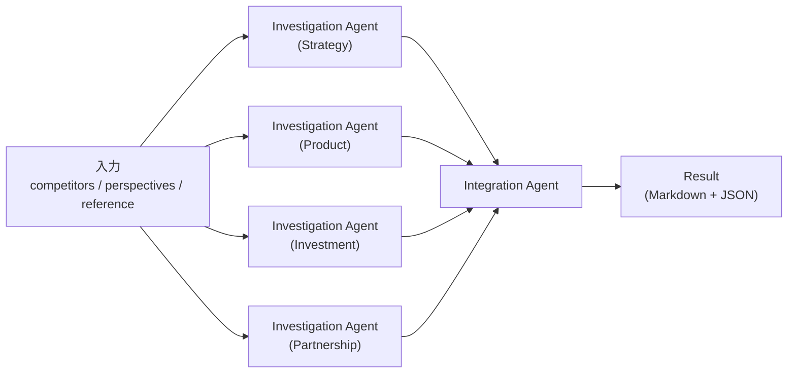

# 競合調査テンプレート詳細仕様

MVP Hero Use Case「競合調査の並列深掘り」を構成するエージェントチームの詳細仕様。`Template.definition`（JSONB）に格納する内容を具体化し、シード投入・エージェント実行・結果レンダリングの前提を揃える。

用語は [glossary.md](../../product/glossary.md) に準拠する。プロダクト文脈は [user-stories.md](../../product/user-stories.md) US-1 / US-2 / US-4、スコープ前提は [ADR-0005](../../adr/0005-mvp-scope.md) を参照。

## 位置付けとスコープ

### Hero UC との関係

> 月次の事業戦略レビュー前、競合 3 社の直近動向を観点別（戦略 / 製品 / 投資 / パートナーシップ）に比較整理し、役員提案の裏付けを 30 分以内に固める（[ADR-0004 JTBD](../../adr/0004-target-users.md) / [ADR-0005 Hero Use Case](../../adr/0005-mvp-scope.md)）。

本テンプレートは上記 JTBD の完遂手段として、Investigation Agent × 4（観点別）＋ Integration Agent × 1 のチーム構成を提供する。

### 本ドキュメントの範囲

- エージェント構成と役割
- 入力パラメータスキーマ
- 各エージェントのシステムプロンプト本文
- 出力フォーマット（Markdown / 内部 JSON）
- LLM 呼び出しパラメータの暫定値

### 本ドキュメントの範囲外

- データモデル設計（エンティティ属性・永続化方針）→ `docs/design/data-model.md`（[Issue #52](https://github.com/kuairen-227/agent-team-studio/issues/52)）
- LLM 呼び出し方針の最終確定（モデル選定根拠・ストリーミング方式・リトライ方針等）→ `docs/design/llm-integration.md`（[Issue #51](https://github.com/kuairen-227/agent-team-studio/issues/51)）
- エージェント並列実行モデル・進捗イベント定義 → `docs/design/agent-execution.md`（[Issue #53](https://github.com/kuairen-227/agent-team-studio/issues/53)）
- WebSocket メッセージ型 → `docs/design/api-design.md` 拡張（[Issue #54](https://github.com/kuairen-227/agent-team-studio/issues/54)）

## エージェント構成

4 体の Investigation Agent が観点別に並列実行し、完了後に 1 体の Integration Agent が統合してマトリクスを生成する。



### エージェント一覧

| agentId | 役割 | 観点 | 入力 | 出力 |
| --- | --- | --- | --- | --- |
| `investigation:strategy` | Investigation Agent | 戦略 | `competitors` / `reference` | 戦略観点の競合別所見（JSON） |
| `investigation:product` | Investigation Agent | 製品 | `competitors` / `reference` | 製品観点の競合別所見（JSON） |
| `investigation:investment` | Investigation Agent | 投資 | `competitors` / `reference` | 投資観点の競合別所見（JSON） |
| `investigation:partnership` | Investigation Agent | パートナーシップ | `competitors` / `reference` | パートナーシップ観点の競合別所見（JSON） |
| `integration:matrix` | Integration Agent | — | 4 Investigation Agent の JSON 出力 | 統合レポート（Markdown）＋内部 JSON |

### 実行順序

- Investigation Agent 4 体は**並列**に起動する
- Integration Agent は**全 Investigation Agent の完了を待って**起動する
- 並列実行の具体的制御（`Promise.all` / スケジューラ / キュー）は A4 [Issue #53](https://github.com/kuairen-227/agent-team-studio/issues/53) で確定する

### 部分失敗時のふるまい

[US-4](../../product/user-stories.md#us-4-統合結果を閲覧しエクスポートする) 受入基準「統合エージェントが失敗した場合、個別エージェントの結果は確認できる」「全エージェントが失敗した場合、失敗した旨と原因が表示される」と整合する方針:

- **一部の Investigation Agent が失敗**: Integration Agent は完了分のみで統合する。失敗観点は Markdown / JSON 上で「取得できませんでした」と明示する
- **全 Investigation Agent が失敗**: Integration Agent は起動せず、実行を `failed` として扱う（UI では各 Investigation Agent の失敗メッセージを表示）
- **Integration Agent が失敗**: 個別 Investigation Agent の生データは結果画面から閲覧可能にする（表示方針の具体は A5 [Issue #54](https://github.com/kuairen-227/agent-team-studio/issues/54) で確定）

## 入力パラメータスキーマ

Template.definition に格納するスキーマを JSON Schema 風の表記で示す。実装時の型定義は `packages/shared/src/domain-types.ts` に配置する想定。

```json
{
  "$schema": "https://json-schema.org/draft/2020-12/schema",
  "title": "CompetitorAnalysisParameters",
  "type": "object",
  "required": ["competitors"],
  "properties": {
    "competitors": {
      "type": "array",
      "description": "調査対象の競合企業名",
      "items": { "type": "string", "minLength": 1, "maxLength": 100 },
      "minItems": 1,
      "maxItems": 5
    },
    "perspectives": {
      "type": "array",
      "description": "調査観点。MVP では固定の 4 観点を既定値として自動付与し、ユーザーによる編集は不可（Non-goals: テンプレート作成・編集）",
      "items": {
        "type": "string",
        "enum": ["strategy", "product", "investment", "partnership"]
      },
      "default": ["strategy", "product", "investment", "partnership"],
      "readOnly": true
    },
    "reference": {
      "type": "string",
      "description": "ユーザーが任意で貼り付ける参考情報。URL を貼り付けた場合も Web 取得は行わず、文字列のまま LLM に渡す（ADR-0005 外部検索 Non-goal）",
      "maxLength": 10000
    }
  }
}
```

### 主要な設計判断

| 項目 | 決定 | 根拠 |
| --- | --- | --- |
| 観点リスト | 固定 4 観点（戦略 / 製品 / 投資 / パートナーシップ） | Hero UC の JTBD 記述に 4 観点が明記されている（ADR-0004）。観点編集 UI は MVP Non-goals（テンプレートのユーザー作成・編集）と整合しないため不要 |
| 競合企業数の上限 | 1〜5 件（MVP 想定は 3 件） | Hero UC が「競合 3 社」を前提。5 件超は 30 分完遂と LLM トークン見積もりの両面で MVP 成功基準 1 を損なうリスクがある |
| 参考情報の文字数上限 | 10,000 文字 | 暫定値。A3 [Issue #51](https://github.com/kuairen-227/agent-team-studio/issues/51) のトークン見積もり結果で調整 |
| 観点の表示順 | `strategy` → `product` → `investment` → `partnership` | ADR-0004 / ADR-0005 の記述順を踏襲し、UI ラベルもこの順で表示する |

### UI ラベル対応

`perspectives` の enum 値と UI 表示の対応は以下。UI 表記は glossary に未登録のため本 doc で確定する。

| enum | 日本語 UI ラベル |
| --- | --- |
| `strategy` | 戦略 |
| `product` | 製品 |
| `investment` | 投資 |
| `partnership` | パートナーシップ |

## システムプロンプト

各エージェントのシステムプロンプト本文を以下に示す。プロンプト本文はテンプレート文字列として保持し、実行時に `competitors` / `reference` / 他エージェント出力を埋め込む。

### Investigation Agent（共通ひな型）

````text
あなたは企業リサーチの専門家です。指定された観点で、競合企業の直近動向を簡潔に整理します。

## 観点
{{perspective_name_ja}}（{{perspective_description}}）

## 入力
- 調査対象企業リスト: {{competitors}}
- 参考情報（任意）: {{reference_or_empty}}

## 指示
1. 上記の各企業について、指定観点に関する要点を 3〜5 個の箇条書きで抽出する
2. 根拠となる事実（製品名 / 数値 / 発表時期 / 関係者名など）を可能な範囲で含める
3. 不明な点は「情報不足」と明記し、推測で埋めない
4. 参考情報が提供されている場合は、その内容を優先的に参照する
5. 最終出力は指定された JSON フォーマットに厳密に従う

## 禁止事項
- Web 検索や外部 URL へのアクセスを試みない（参考情報は事前提供のテキストのみ）
- 事実と推測を混在させない
- 他の観点（本エージェントの担当外）には言及しない

## 出力フォーマット
以下の JSON のみを出力する。前後に説明文を付けない。

```json
{
  "perspective": "{{perspective_key}}",
  "findings": [
    {
      "competitor": "<企業名>",
      "points": ["<要点1>", "<要点2>"],
      "evidence_level": "strong" | "moderate" | "weak" | "insufficient",
      "notes": "<補足（任意、情報不足の理由等）>"
    }
  ]
}
```
````

### Investigation Agent の specialization

共通ひな型の `{{perspective_name_ja}}` / `{{perspective_description}}` / `{{perspective_key}}` に以下の値を差し込む。

#### Strategy（戦略）

- `perspective_name_ja`: 戦略
- `perspective_key`: `strategy`
- `perspective_description`: 事業ミッション・ビジョン、注力セグメント、地理的展開、直近の戦略発表、組織再編

#### Product（製品）

- `perspective_name_ja`: 製品
- `perspective_key`: `product`
- `perspective_description`: 主力プロダクトの機能・価格、直近のリリース / アップデート、差別化ポイント、ターゲット顧客層

#### Investment（投資）

- `perspective_name_ja`: 投資
- `perspective_key`: `investment`
- `perspective_description`: 直近の資金調達（金額・投資家・バリュエーション）、M&A の実施 / 対象、主要株主の動向

#### Partnership（パートナーシップ）

- `perspective_name_ja`: パートナーシップ
- `perspective_key`: `partnership`
- `perspective_description`: 技術提携・販売提携・共同開発、主要顧客 / 導入事例、エコシステム（プラグイン・SDK 等）の連携先

### Integration Agent

````text
あなたは事業戦略アナリストです。複数の観点で調査された情報を統合し、意思決定者が一覧比較しやすいマトリクス形式のレポートを生成します。

## 入力
- 調査対象企業リスト: {{competitors}}
- Investigation Agent の出力（4 観点分の JSON 配列）: {{investigation_results}}
- 参考情報（任意）: {{reference_or_empty}}

## 指示
1. 観点×競合のマトリクスを生成する。行＝観点（戦略 / 製品 / 投資 / パートナーシップ）、列＝競合企業
2. 各セルには、その観点×企業で最も重要な 1〜3 点を簡潔に記述する
3. 観点をまたいだ全体所見（3〜5 行）をマトリクスの末尾に追加する
4. ある観点の Investigation Agent 出力が欠落している、もしくは `evidence_level` が `insufficient` の場合、該当セルは「情報不足」と明記する
5. 出力は Markdown と、内部保持用 JSON の 2 形式。両者が同一内容を指すこと

## 禁止事項
- 入力にない情報を捏造しない
- 企業ごと・観点ごとの分量を極端に偏らせない
- Investigation Agent の出力と矛盾する記述をしない（矛盾を発見した場合は「Investigation Agent 間で情報に齟齬あり」と所見欄に明記する）

## 出力フォーマット
以下の 2 ブロックを続けて出力する。

### 1. Markdown レポート
- 見出し構造は「## 観点×競合マトリクス」→ 表 → 「## 全体所見」の順
- 表のヘッダ: 空セル + 競合企業名
- 行ヘッダ: 観点の日本語ラベル

### 2. 内部 JSON
```json
{
  "matrix": [
    {
      "perspective": "strategy" | "product" | "investment" | "partnership",
      "cells": [
        { "competitor": "<企業名>", "summary": "<要点>", "source_evidence_level": "strong" | "moderate" | "weak" | "insufficient" }
      ]
    }
  ],
  "overall_insights": ["<所見1>", "<所見2>"],
  "missing": [
    { "perspective": "...", "reason": "agent_failed" | "insufficient_evidence" }
  ]
}
```
````

### プロンプト管理の方針

- プロンプト本文は Markdown の形のまま Template.definition（JSONB）に保持する。テンプレート置換は `{{name}}` 形式の単純置換で実装する（実装詳細は A4 で確定）
- プロンプトの改訂履歴は git に残す。バージョン管理キー（例: `definition.version`）は A2 のデータモデル設計で導入の要否を判断する

## 出力フォーマット

### Markdown（ユーザー向け）

Integration Agent の Markdown 出力が Result に永続化され、結果画面で表示・エクスポートされる（[US-4](../../product/user-stories.md#us-4-統合結果を閲覧しエクスポートする)）。構造例:

```markdown
## 観点×競合マトリクス

|  | Company A | Company B | Company C |
| --- | --- | --- | --- |
| 戦略 | ... | ... | ... |
| 製品 | ... | ... | ... |
| 投資 | ... | ... | ... |
| パートナーシップ | ... | ... | 情報不足 |

## 全体所見

- ...
- ...
```

### 内部 JSON（永続化・UI レンダリング補助）

Integration Agent の JSON 出力は Result に併せて保存し、UI でのセルハイライトや v2 での再利用に備える。スキーマは「Integration Agent」節の出力フォーマット参照。

個別 Investigation Agent の JSON 出力も併せて保存する（統合失敗時の個別結果表示、[US-4](../../product/user-stories.md#us-4-統合結果を閲覧しエクスポートする) 受入基準）。永続化テーブル設計は A2 [Issue #52](https://github.com/kuairen-227/agent-team-studio/issues/52) で確定する。

## LLM 呼び出しパラメータ（デフォルト）

本 doc では暫定値のみ提示する。最終確定は A3 [Issue #51](https://github.com/kuairen-227/agent-team-studio/issues/51) で行う。

| エージェント | model（暫定） | temperature | max_tokens |
| --- | --- | --- | --- |
| Investigation Agent（全観点共通） | Sonnet 系 | 0.3 | 2,048 |
| Integration Agent | Sonnet 系 | 0.2 | 4,096 |

### 暫定値の根拠

- **Sonnet 系**: 出力品質とレスポンス速度のバランス。Opus はコスト、Haiku は出力構造の安定性の観点から第二候補とし、A3 で最終化
- **temperature**: 事実整理タスクのため低めに設定。Integration Agent は矛盾を抑える目的でさらに低く
- **max_tokens**: 観点あたり競合 3〜5 件の箇条書き想定で Investigation 2,048、マトリクス＋所見で Integration 4,096 を暫定とする

### A3 で確定する事項

- 具体的な model ID（例: `claude-sonnet-4-6`）
- ストリーミング方式と WebSocket への中継
- エラー・リトライ方針（429 / 5xx / timeout）
- 1 実行あたりのトークン見積もりとコスト概算

## 関連ドキュメント

- [ADR-0003 プロダクトコンセプト](../../adr/0003-product-concept.md)
- [ADR-0004 ターゲットユーザー](../../adr/0004-target-users.md)
- [ADR-0005 MVP スコープ](../../adr/0005-mvp-scope.md)
- [ADR-0009 アーキテクチャ方針](../../adr/0009-architecture.md)
- [user-stories.md](../../product/user-stories.md)（US-1 / US-2 / US-4）
- [glossary.md](../../product/glossary.md)
- [screen-flow.md](../../product/screen-flow.md)
- [api-design.md](../api-design.md)
