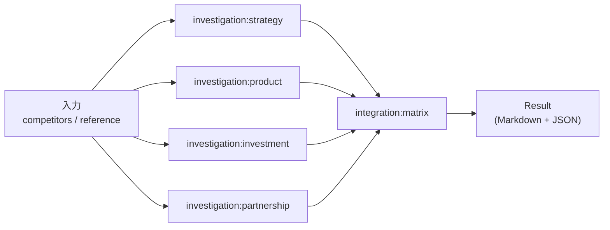

# 競合調査テンプレート実装仕様

MVP 競合調査テンプレートの実装仕様。プロンプト本文・観点の意味づけ・出力 Markdown 構造・失敗時 UX などプロダクト視点の仕様は [docs/product/templates/competitor-analysis.md](../../product/templates/competitor-analysis.md) を参照。

本 doc は以下の実装ブロッカー解消を目的とする:

- エージェント ID と実行順序の技術契約（詳細制御は A4 で確定）
- 入力パラメータの型制約（JSON Schema）
- 内部 JSON 出力スキーマ（Investigation / Integration）
- `Template.definition`（JSONB）格納形式とテンプレート置換方式
- LLM 呼び出しパラメータの暫定値（A3 で最終化）

## エージェント ID と実行順序



| agentId | 種別 | 入力 | 出力 |
| --- | --- | --- | --- |
| `investigation:strategy` | Investigation Agent | `competitors` / `reference` | Investigation 出力 JSON |
| `investigation:product` | Investigation Agent | `competitors` / `reference` | Investigation 出力 JSON |
| `investigation:investment` | Investigation Agent | `competitors` / `reference` | Investigation 出力 JSON |
| `investigation:partnership` | Investigation Agent | `competitors` / `reference` | Investigation 出力 JSON |
| `integration:matrix` | Integration Agent | 4 Investigation 出力 JSON / `reference` | Integration 出力（Markdown + JSON） |

### 実行順序

- Investigation Agent 4 体は**並列**に起動
- Integration Agent は**全 Investigation Agent の完了を待って**起動
- 並列実行の具体的制御（`Promise.all` / スケジューラ / キュー）は A4（[Issue #53](https://github.com/kuairen-227/agent-team-studio/issues/53)）で確定

### 部分失敗時の実装上の扱い

プロダクト仕様は [product/templates/competitor-analysis.md #失敗時のふるまい](../../product/templates/competitor-analysis.md#失敗時のふるまいユーザー視点) を参照。実装上の要点:

- Integration Agent の入力から失敗観点を除外し、除外した観点を `missing` 配列で出力する
- 全 Investigation Agent が失敗した場合、Integration Agent は起動せず Execution を `failed` とする
- 個別 Investigation Agent の生データは Result に併せて保存（UI で個別閲覧可能にするため）

## 入力パラメータ JSON Schema

実装時の型定義は `packages/shared/src/domain-types.ts` に配置する想定。

```json
{
  "$schema": "https://json-schema.org/draft/2020-12/schema",
  "title": "CompetitorAnalysisParameters",
  "type": "object",
  "required": ["competitors"],
  "properties": {
    "competitors": {
      "type": "array",
      "description": "調査対象の競合企業名",
      "items": { "type": "string", "minLength": 1, "maxLength": 100 },
      "minItems": 1,
      "maxItems": 5
    },
    "perspectives": {
      "type": "array",
      "description": "調査観点。MVP では固定の 4 観点を既定値として自動付与し、ユーザーによる編集は不可",
      "items": {
        "type": "string",
        "enum": ["strategy", "product", "investment", "partnership"]
      },
      "default": ["strategy", "product", "investment", "partnership"],
      "readOnly": true
    },
    "reference": {
      "type": "string",
      "description": "ユーザーが任意で貼り付ける参考情報。URL を貼り付けても Web 取得は行わない",
      "maxLength": 10000
    }
  }
}
```

制約値（`maxItems: 5` / `maxLength: 10000` 等）の根拠は [product doc の入力項目](../../product/templates/competitor-analysis.md#入力項目ユーザー視点) を参照。

## 内部 JSON 出力スキーマ

### Investigation Agent 出力

```json
{
  "perspective": "strategy" | "product" | "investment" | "partnership",
  "findings": [
    {
      "competitor": "<企業名>",
      "points": ["<要点1>", "<要点2>"],
      "evidence_level": "strong" | "moderate" | "weak" | "insufficient",
      "notes": "<補足（任意、情報不足の理由等）>"
    }
  ]
}
```

`evidence_level` の判定基準は Investigation Agent のプロンプト（product doc）が LLM に判定させる。`insufficient` の場合、Integration Agent はそのセルを「情報不足」として扱う。

### Integration Agent 出力（内部保持用 JSON）

Markdown レポートと並行して保存する機械可読形式。UI でのセルハイライトや v2 での再利用に備える。

```json
{
  "matrix": [
    {
      "perspective": "strategy" | "product" | "investment" | "partnership",
      "cells": [
        {
          "competitor": "<企業名>",
          "summary": "<要点>",
          "source_evidence_level": "strong" | "moderate" | "weak" | "insufficient"
        }
      ]
    }
  ],
  "overall_insights": ["<所見1>", "<所見2>"],
  "missing": [
    {
      "perspective": "strategy" | "product" | "investment" | "partnership",
      "reason": "agent_failed" | "insufficient_evidence"
    }
  ]
}
```

個別 Investigation Agent 出力も Result に併せて保存する（統合失敗時の個別結果表示、[US-4](../../product/user-stories.md#us-4-統合結果を閲覧しエクスポートする) 受入基準）。永続化テーブル設計は A2（[Issue #52](https://github.com/kuairen-227/agent-team-studio/issues/52)）で確定する。

## `Template.definition` 格納方針

`Template.definition`（JSONB）に格納する内容:

- エージェント定義配列（`agentId` / 種別 / 差し込むプロンプト変数）
- プロンプトテンプレート本文（product doc のシステムプロンプトを文字列として保持）
- 入力パラメータ JSON Schema
- LLM 呼び出しパラメータ

テンプレート置換は `{{name}}` 形式の単純置換で実装する。置換変数:

| 変数 | 値の出所 |
| --- | --- |
| `{{competitors}}` | 入力パラメータ `competitors` を整形した文字列 |
| `{{reference_or_empty}}` | 入力パラメータ `reference` または空文字 |
| `{{perspective_name_ja}}` | エージェント定義に持たせる specialization 値 |
| `{{perspective_description}}` | 同上 |
| `{{perspective_key}}` | 同上 |
| `{{investigation_results}}` | 全 Investigation Agent の出力 JSON 配列（整形済み文字列） |

バージョン管理キー（例: `definition.version`）の要否は A2 のデータモデル設計で判断する。プロンプト改訂履歴は git に残す。

## LLM 呼び出しパラメータ（暫定）

本 doc では暫定値のみ提示する。最終確定は A3（[Issue #51](https://github.com/kuairen-227/agent-team-studio/issues/51)）で行う。

| エージェント | model（暫定） | temperature | max_tokens |
| --- | --- | --- | --- |
| Investigation Agent（全観点共通） | Sonnet 系 | 0.3 | 2,048 |
| Integration Agent | Sonnet 系 | 0.2 | 4,096 |

### 暫定値の根拠

- **Sonnet 系**: 出力品質とレスポンス速度のバランス。Opus はコスト、Haiku は出力構造の安定性の観点から第二候補とし、A3 で最終化
- **temperature**: 事実整理タスクのため低めに設定。Integration Agent は矛盾を抑える目的でさらに低く
- **max_tokens**: 観点あたり競合 3〜5 件の箇条書き想定で Investigation 2,048、マトリクス＋所見で Integration 4,096 を暫定とする

### A3 で確定する事項

- 具体的な model ID（例: `claude-sonnet-4-6`）
- ストリーミング方式と WebSocket への中継
- エラー・リトライ方針（429 / 5xx / timeout）
- 1 実行あたりのトークン見積もりとコスト概算

## 関連ドキュメント

- [ADR-0005 MVP スコープ](../../adr/0005-mvp-scope.md)
- [ADR-0009 アーキテクチャ方針](../../adr/0009-architecture.md)
- [architecture.md](../architecture.md)（`packages/agent-core` の位置付け）
- [api-design.md](../api-design.md)（REST/WS との接続）
- [product/templates/competitor-analysis.md](../../product/templates/competitor-analysis.md)（プロダクト視点の仕様）
