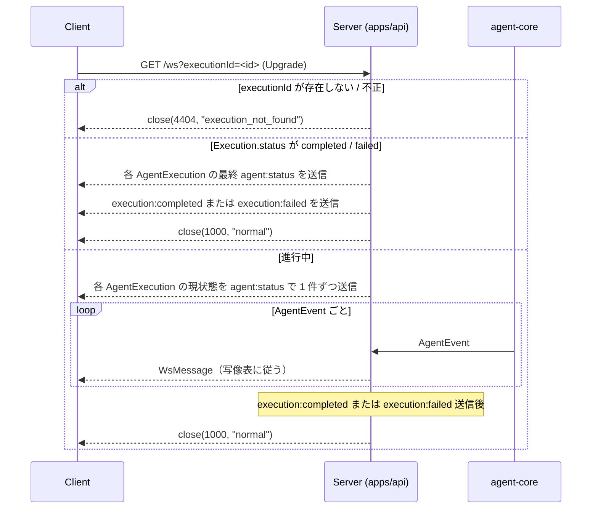

# WebSocket メッセージ設計

リアルタイム進捗表示（[ADR-0005 MVP スコープ](../adr/0005-mvp-scope.md) / [user-stories.md US-3](../product/user-stories.md)）の通信契約。agent-core が発行する [`AgentEvent`](./agent-execution.md) を WS 層の `WsMessage` に写像する。REST API は [api-design.md](./api-design.md) を参照。

## 接続

```text
ws://localhost:3000/ws?executionId=<id>
```

実行開始（`POST /api/executions` で 202 を受領）後、`executionId` をクエリに付けて接続する。MVP では認証なし（ローカル前提）。

## メッセージ方向

- **サーバー → クライアント**: エージェントのステータス更新、出力ストリーミング、完了・失敗通知
- **クライアント → サーバー**: MVP では送信なし（接続のみ。将来的に中断・再開コマンドを追加する余地）

## メッセージ型（discriminated union）

`type` フィールドで種別を識別する。本節は **暫定 SSoT** であり、実装後は `packages/shared/src/ws-types.ts` を SSoT とする。

```typescript
// 暫定 SSoT。実装後は packages/shared/src/ws-types.ts を SSoT とする。
type WsMessage =
  | {
      type: "agent:status";
      agentId: string;
      status: "pending" | "running" | "completed" | "failed";
      reason?: AgentFailReason; // status = "failed" のときのみ
      timestamp: string;        // ISO 8601
    }
  | {
      type: "agent:output";
      agentId: string;
      chunk: string;
    }
  | {
      type: "execution:completed";
      executionId: string;
      resultId: string;
    }
  | {
      type: "execution:failed";
      executionId: string;
      reason: ExecutionFailReason;
    };

type AgentFailReason = "llm_error" | "output_parse_error" | "timeout";
type ExecutionFailReason = "all_investigations_failed" | "integration_failed" | "timeout";
```

設計上の補足:

- `status` の語彙は [data-model.md §5](./data-model.md) の `AgentExecution.status`（`pending | running | completed | failed`）と一致させる
- `agentId` の表記規則は [agent-execution.md §3](./agent-execution.md)（`<role>:<key>` 形式）に従う
- `reason` の語彙は [agent-execution.md §5](./agent-execution.md) の `AgentFailReason` / `ExecutionFailReason` と一致させる
- `timestamp` は `agent_started/agent_completed/agent_failed` のいずれかの発火時刻を 1 フィールドに集約
- `reason?` は暫定表現。実装時（`ws-types.ts`）に `status: "failed"` の専用バリアントへ分離して型安全性を高めることを推奨する（本 doc スコープ外の実装判断）

## AgentEvent → WsMessage 写像

| `AgentEvent.kind` | `WsMessage` | 写像内容 |
| --- | --- | --- |
| `agent_started` | `{ type: "agent:status", status: "running", timestamp: startedAt }` | — |
| `agent_output_chunk` | `{ type: "agent:output", chunk }` | — |
| `agent_completed` | `{ type: "agent:status", status: "completed", timestamp: completedAt }` | — |
| `agent_failed` | `{ type: "agent:status", status: "failed", reason, timestamp: failedAt }` | `reason` をそのまま転送 |
| `execution_completed` | `{ type: "execution:completed", executionId, resultId }` | `executionId` は接続コンテキストから付与 |
| `execution_failed` | `{ type: "execution:failed", executionId, reason }` | `executionId` は接続コンテキストから付与 |

`status = "pending"` は本写像表に対応する `AgentEvent` を持たない — 初期スナップショット（接続直後の現状態通知）でのみ送信される。実装時に `agent_pending` イベントを新設する必要はない。

## 接続ライフサイクル



1. **ハンドシェイク**: クライアントが `ws://.../ws?executionId=<id>` に接続。サーバは `executionId` の存在と形式を検証し、不正なら close code `4404`（reason: `execution_not_found`）で切断する
2. **初期スナップショット**: 接続確立直後、サーバは現時点の各 `AgentExecution` について `agent:status` を 1 件ずつ送信する（`Execution.status = pending` 中なら全 agent が `pending`、進行中なら実状態、完了済みなら最終状態）
3. **完了済み Execution への接続**: `Execution.status ∈ {completed, failed}` の場合、初期スナップショット送信後に対応する `execution:completed` / `execution:failed` メッセージを 1 件送信し、close code `1000` で切断する（以降の進行中フローは発生しない）。クライアントは進行中・完了後で同一のハンドリングコードを使えるため分岐が不要
4. **進行中**: agent-core が `AgentEvent` を発火するたび、写像表に従って `WsMessage` を配信する
5. **正常終了**: `execution:completed` または `execution:failed` を送信後、サーバ主導で close code `1000` で切断する
6. **クライアント主導の切断**: ブラウザリロードや遷移で切断された場合、サーバは復旧処理を行わず以後のメッセージは破棄する（[user-stories.md US-3](../product/user-stories.md) 注記「実行中のリロード復旧は対象外」と整合）

## エラーイベント

エラーは性質によって表現を分ける。

| 種別 | 表現 | 例 |
| --- | --- | --- |
| ドメイン失敗（実行が確定的に失敗） | `execution:failed` メッセージ | `all_investigations_failed` / `integration_failed` / `timeout` |
| 個別エージェント失敗 | `agent:status` の `status="failed"` + `reason` | `llm_error` / `output_parse_error` / `timeout` |
| 接続レベルのエラー | WebSocket close code + reason | `4404 execution_not_found` |

サーバ内部例外で `AgentEvent` の発行に失敗しても DB が真の状態を保持する（[agent-execution.md §副作用の順序](./agent-execution.md)）。クライアントが再接続すれば初期スナップショットで現状態が復元される。

## 再接続ポリシー（MVP）

- **サーバ側**: ステートレス。再接続は新規接続と同じ扱いで、初期スナップショットから再開する
- **クライアント側**: MVP では自動再接続を実装しない（[user-stories.md US-3](../product/user-stories.md) 注記「中断・再開は対象外」）。リロード後に進行状況を追う場合は実行履歴ページ（US-4）から `GET /api/executions/:id` で完了後の結果を確認する
- `agent:output` chunk の重複・欠落のリカバリは行わない。最終結果の確からしさは履歴 API（永続化済みの `AgentExecution.output` と `Result`）で担保する

## メッセージ順序保証

- 同一 `agentId` 内の `agent:output` chunk は送信順が保持される（単一 WS 接続なので TCP 順序に従う）
- 異なる `agentId` 間の相対順序は保証しない（Investigation Agent は並列実行のため、[agent-execution.md §4](./agent-execution.md)）
- 同一 agent 内では `agent:status` と `agent:output` がインタリーブしうる。クライアントは `agent:output` を受信した時点で当該 agent を `running` とみなしてよい

## 型共有

フロント・バックエンド間の WS 型は `packages/shared/src/ws-types.ts` で一元管理する（REST 型と同じ方針、[api-design.md §型共有](./api-design.md) 参照）。`ws-types.ts` の内容は本ドキュメント §メッセージ型 と厳密に一致させ、実装後はコード側を SSoT とし本 doc は参照リンクに切り替える。
