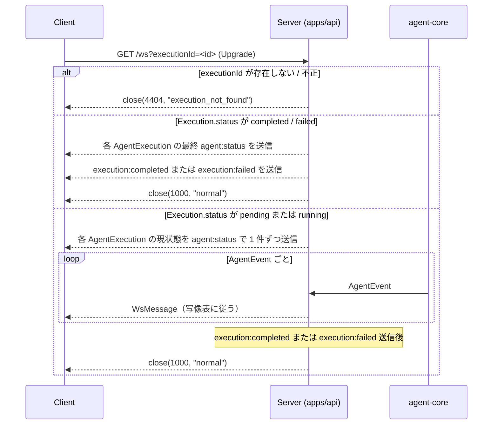

# WebSocket メッセージ設計

リアルタイム進捗表示（[ADR-0005 MVP スコープ](../adr/0005-mvp-scope.md) / [user-stories.md US-3](../product/user-stories.md)）の通信契約。agent-core が発行する [`AgentEvent`](./agent-execution.md) を WS 層の `WsMessage` に写像する。REST API は [api-design.md](./api-design.md) を参照。

## 接続

```text
/ws?executionId=<id>
```

実行開始（`POST /api/executions` で 202 を受領）後、`executionId` をクエリに付けて接続する。絶対 URL（スキーム・ホスト・ポート）は環境依存のため本 doc では規定しない。MVP では認証なし（ローカル前提）。

## メッセージ方向

- **サーバー → クライアント**: エージェントのステータス更新、出力ストリーミング、完了・失敗通知
- **クライアント → サーバー**: MVP では送信なし（接続のみ。将来的に中断・再開コマンドを追加する余地）

## メッセージ型（discriminated union）

`type` フィールドで種別を識別する。本節は **暫定 SSoT** であり、実装後は `packages/shared/src/ws-types.ts` を SSoT とする。

```typescript
// 暫定 SSoT。実装後は packages/shared/src/ws-types.ts を SSoT とする。
type WsMessage =
  | {
      type: "agent:status";
      agentId: string;
      status: "pending" | "running" | "completed" | "failed";
      reason?: AgentFailReason; // status = "failed" のときのみ
      timestamp: string;        // ISO 8601
    }
  | {
      type: "agent:output";
      agentId: string;
      chunk: string;
    }
  | {
      type: "execution:completed";
      executionId: string;
      resultId: string;
    }
  | {
      type: "execution:failed";
      executionId: string;
      reason: ExecutionFailReason;
    };

type AgentFailReason = "llm_error" | "output_parse_error" | "timeout";
type ExecutionFailReason = "all_investigations_failed" | "integration_failed" | "timeout";
```

設計上の補足:

- `status` の語彙は [data-model.md §5](./data-model.md) の `AgentExecution.status`（`pending | running | completed | failed`）と一致させる
- `agentId` の表記規則は [agent-execution.md §3](./agent-execution.md)（`<role>:<key>` 形式）に従う
- `reason` の語彙は [agent-execution.md §5](./agent-execution.md) の `AgentFailReason` / `ExecutionFailReason` と一致させる
- `timestamp` は `agent_started/agent_completed/agent_failed` のいずれかの発火時刻を 1 フィールドに集約
- `timestamp` は `agent:status` のみに持たせる。`agent:output` chunk は TCP 順序で十分（chunk ごとの timestamp はノイズになる）、`execution:completed` / `execution:failed` の完了時刻は DB 側が正（[`agent-execution.md §4`](./agent-execution.md) で `Execution.completed_at` が INSERT 済み、REST `GET /api/executions/:id` で取得可能）。WS 側に二重管理を持ち込まない
- `reason?` は暫定表現。型安全性のため MVP の `ws-types.ts` 作成時（packages/shared への移植）に `status: "failed"` の専用バリアントへ分離して確定する方針（v2 先送りにしない）

## AgentEvent → WsMessage 写像

本表は Investigation / Integration を問わず、すべての `AgentExecution` に一律適用する（`agentId` の `<role>:<key>` 表記のみ異なる）。

| `AgentEvent.kind` | `WsMessage` | 写像内容 |
| --- | --- | --- |
| `agent_started` | `{ type: "agent:status", status: "running", timestamp: startedAt }` | — |
| `agent_output_chunk` | `{ type: "agent:output", chunk }` | — |
| `agent_completed` | `{ type: "agent:status", status: "completed", timestamp: completedAt }` | — |
| `agent_failed` | `{ type: "agent:status", status: "failed", reason, timestamp: failedAt }` | `reason` をそのまま転送 |
| `execution_completed` | `{ type: "execution:completed", executionId, resultId }` | `executionId` は接続コンテキストから付与 |
| `execution_failed` | `{ type: "execution:failed", executionId, reason }` | `executionId` は接続コンテキストから付与 |

`status = "pending"` は本写像表に対応する `AgentEvent` を持たない — 初期スナップショット（接続直後の現状態通知）でのみ送信される。実装時に `agent_pending` イベントを新設する必要はない。

`agent:status` / `agent:output` の `agentId` は対応する `AgentEvent.agentId` のパススルー。`execution:completed` / `execution:failed` の `executionId` は接続コンテキスト（ハンドシェイク時のクエリパラメータ）から付与する。

## 接続ライフサイクル



1. **ハンドシェイク**: クライアントが `ws://.../ws?executionId=<id>` に接続。サーバは `executionId` の存在と形式を検証し、不正なら close code `4404`（reason: `execution_not_found`）で切断する
2. **初期スナップショット**: 接続確立直後、サーバは現時点の各 `AgentExecution` について `agent:status` を 1 件ずつ送信する（`Execution.status = pending` 中なら全 agent が `pending`、進行中なら実状態、完了済みなら最終状態）。送信件数はテンプレートで定義された agent 数と一致し、`Execution.status` に依存しない（[`agent-execution.md §4`](./agent-execution.md) により `POST /api/executions` 受理時に `AgentExecution × N` が pending で INSERT 済みのため）。MVP では Investigation 4 件 + Integration 1 件の計 5 件
3. **完了済み Execution への接続**: `Execution.status ∈ {completed, failed}` の場合、初期スナップショット送信後に対応する `execution:completed` / `execution:failed` メッセージを 1 件送信し、close code `1000` で切断する（以降の進行中フローは発生しない）。クライアントは進行中・完了後で同一のハンドリングコードを使えるため分岐が不要
4. **進行中**: agent-core が `AgentEvent` を発火するたび、写像表に従って `WsMessage` を配信する
5. **正常終了**: `execution:completed` または `execution:failed` を送信後、サーバ主導で close code `1000` で切断する
6. **クライアント主導の切断**: ブラウザリロードや遷移で切断された場合、サーバは復旧処理を行わず以後のメッセージは破棄する（[user-stories.md US-3](../product/user-stories.md) 注記「実行中のリロード復旧は対象外」と整合）

## エラーイベント

エラーは性質によって表現を分ける。

| 種別 | 表現 | 例 |
| --- | --- | --- |
| ドメイン失敗（実行が確定的に失敗） | `execution:failed` メッセージ | `all_investigations_failed` / `integration_failed` / `timeout` |
| 個別エージェント失敗 | `agent:status` の `status="failed"` + `reason` | `llm_error` / `output_parse_error` / `timeout` |
| サーバ内部例外（`AgentEvent` 発行失敗等） | WebSocket close code + reason | `1011 server_error` |
| 接続レベルのエラー（不正 executionId 等） | WebSocket close code + reason | `4404 execution_not_found` |

複数種別が共存するケースは [`agent-execution.md §6`](./agent-execution.md) のフローに準拠する。例として全 Investigation 失敗時は `agent:status failed × 4 → execution:failed` の順で届く（クライアントは agent レベルの失敗を受信しても終端処理を待ち、`execution:failed` / `execution:completed` を受け取ってから確定処理に入る）。

サーバ内部例外で `AgentEvent` の発行に失敗した場合は `close(1011, "server_error")` で切断する（接続を維持するとクライアントが無期限待機に陥るため。MVP の「自動再接続なし」ポリシーと整合）。DB は真の状態を保持しているため（[agent-execution.md §副作用の順序](./agent-execution.md)）、クライアントが手動リロード後に再接続すれば初期スナップショットで現状態が復元される。

## 再接続ポリシー（MVP）

- **サーバ側**: ステートレス。再接続は新規接続と同じ扱いで、初期スナップショットから再開する
- **クライアント側**: MVP では自動再接続を実装しない（[user-stories.md US-3](../product/user-stories.md) 注記「中断・再開は対象外」）。リロード後に進行状況を追う場合は実行履歴ページ（US-4）から `GET /api/executions/:id` で完了後の結果を確認する
- `agent:output` chunk の重複・欠落のリカバリは行わない。最終結果の確からしさは履歴 API（永続化済みの `AgentExecution.output` と `Result`）で担保する

## メッセージ順序保証

- 同一 `agentId` 内のメッセージ順序は決定論的: `agent:status running → agent:output × N → agent:status completed/failed`（`agent_started` → `agent_output_chunk` → `agent_completed/failed` の発行順と副作用順序、[agent-execution.md §5](./agent-execution.md) 準拠）。単一 WS 接続のため TCP 順序で保持される
- 異なる `agentId` のメッセージは同一 WS 接続上で混在しうる（Investigation Agent は並列実行のため、[agent-execution.md §4](./agent-execution.md)）。異なる agent 間の相対順序は保証しない
- クライアントは `agent:output` 受信時点で当該 agent を `running` とみなしてよい（先行する `agent:status running` を取りこぼしても実害はない。UI バッジが `pending → running` へ切り替わるタイミングが数 ms 遅れるだけで、機能的影響はない）

## 型共有

フロント・バックエンド間の WS 型は `packages/shared/src/ws-types.ts` で一元管理する（REST 型と同じ方針、[api-design.md §型共有](./api-design.md) 参照）。`ws-types.ts` の内容は本ドキュメント §メッセージ型 と厳密に一致させ、実装後はコード側を SSoT とし本 doc は参照リンクに切り替える。
