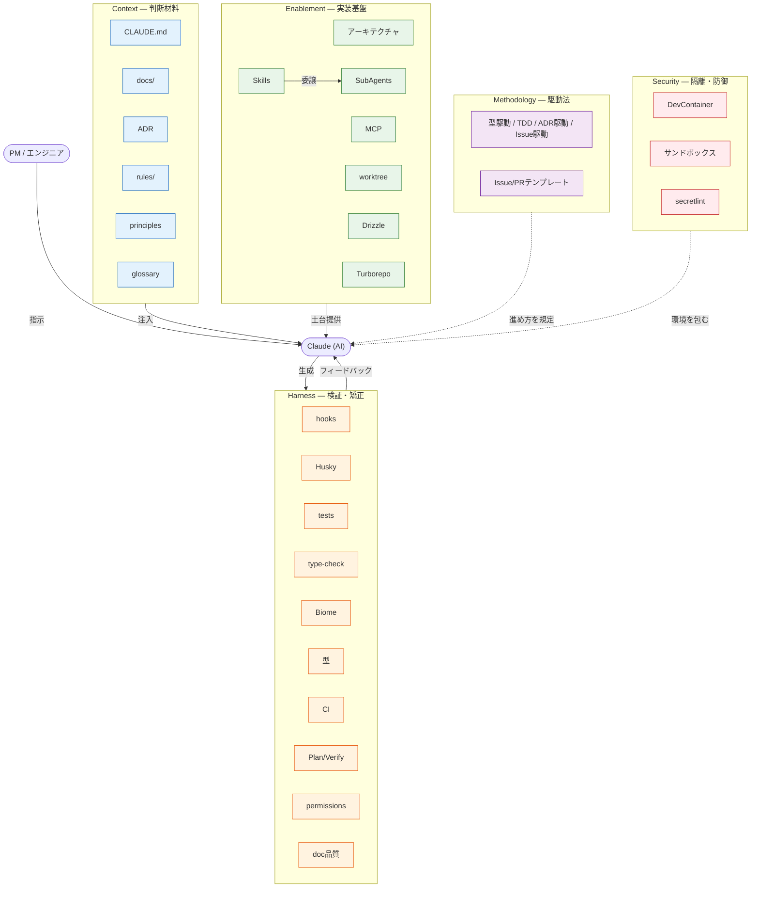

# AI 駆動開発の全体像

本リポジトリの AI（Claude Code）協働環境を構成する施策の全体像。各施策を 5 つの分類で整理し、それぞれが AI 駆動開発で果たす役割と、本リポジトリでの実体を棚卸しする。意思決定の背景は [ADR-0007](../adr/0007-ai-driven-dev-architecture.md) と [ADR-0011](../adr/0011-role-based-agent-architecture.md) を参照。

## 設計思想

ハーネスは「AI が迷わず動ける環境」ではなく、「**AI と人間が同じ制約の中で動く環境**」として設計している。ルールは AI を縛るためではなく、人間が書いても AI が書いても同じ品質になるための共通の型を提供する。

## 5 つの分類

| 分類 | 役割 | 一言で |
| --- | --- | --- |
| **Context** | AI に判断材料を注入する | AI が「何を知っているか」 |
| **Enablement** | AI の実装を可能にする土台 | AI が「何で作れるか」 |
| **Harness** | AI の生成物を検証・矯正する | AI の出力を「どう正すか」 |
| **Security** | 実行環境を隔離・防御する | AI を「どう包むか」 |
| **Methodology** | 進め方そのものを規定する | AI と「どう進めるか」 |

各施策は主分類で代表させつつ、性質が複数にまたがるものは補助分類を併記する（多重タグ）。

## 全体像

実線は AI の作業ループへの直接寄与、点線は環境・進め方の枠付けを表す。

## 施策インベントリ

| 施策 | 主分類 | 補助分類 | AI 駆動開発での役割 | 本リポジトリの実体・状況 |
| --- | --- | --- | --- | --- |
| CLAUDE.md | Context | — | 常時ロードの規約・コマンド・原則ベースライン | `CLAUDE.md` |
| ドキュメント | Context | — | 詳細知識（guides / design / product / milestones） | `docs/` |
| ADR | Context | Methodology | 意思決定の根拠を記録（ADR 駆動） | `docs/adr/` |
| rules | Context | Harness | パスマッチで追加制約を自動注入 | `.claude/rules/` |
| glossary | Context | — | 用語統一 | `docs/product/glossary.md` |
| principles | Context | — | 横断原則の SSoT | `docs/principles/` |
| 型（TypeScript） | Harness | Context | コンパイル検証＋意図の表現 | 全 TS / `type-check` |
| テスト | Harness | Methodology | 振る舞いの検証（軽量 TDD） | `bun run test` |
| hooks | Harness | — | tool call 後の決定論的 enforce | `.claude/hooks/` |
| Husky / lint-staged | Harness | — | commit 前ゲート | `package.json` |
| Plan / Verify ループ | Harness | Methodology | 計画→実行→検証の反復 | implement-feature 手順 |
| Biome lint / format | Harness | — | 静的解析・整形 | `bun run lint` |
| CI（Actions） | Harness | — | 統合検証（lint / type / test / spell / secret） | `.github/workflows/` |
| ドキュメント品質ハーネス | Harness | — | markdownlint / link-check / cspell による文書検証 | `lint:md` / `lint:md-links` / `lint:spell` |
| permissions | Harness | Security | 全 tool call の許可 / 拒否網 | `.claude/settings.json` |
| Skills | Enablement | Harness | 定型手順の自動化・再利用 | `.claude/skills/` |
| SubAgents | Enablement | Harness | 専門視点の分離・知識の再利用 | `.claude/agents/` |
| MCP | Enablement | Context | 外部知識（context7）・動作確認（playwright） | `enabledMcpjsonServers` |
| アーキテクチャ | Enablement | Context | 層分離で実装場所が予測可能 | [ADR-0009](../adr/0009-architecture.md) |
| Drizzle（型生成） | Enablement | Harness | スキーマ→型安全なクライアント生成 | `db:generate` / `packages/db` |
| Turborepo | Enablement | — | 全ワークスペース横断コマンドの予測可能な実行 | `turbo.json` |
| worktree | Enablement | — | 並行セッションの隔離作業場 | [worktree.md](./worktree.md) |
| DevContainer | Security | Enablement | 隔離された再現可能な開発環境 | [devcontainer.md](./devcontainer.md) |
| サンドボックス | Security | — | tool 実行の隔離 | Claude Code の tool 実行サンドボックス（DevContainer とは別レイヤ） |
| secretlint | Security | Harness | 機密情報の検出 | `bun run lint:secret` |
| Issue/PR テンプレート | Methodology | Context | 人間にも AI にも構造化入力を強制する型 | `.github/ISSUE_TEMPLATE/` / `PULL_REQUEST_TEMPLATE.md` |
| 駆動法群 | Methodology | — | 型駆動 / 軽量 TDD / ADR 駆動 / Issue 駆動 | [ADR-0010](../adr/0010-development-workflow.md)（駆動法定義） / [ADR-0006](../adr/0006-lightweight-agile-process.md)（前提整備） |

## 各分類の設計意図

### Context — 文脈の経済性

**問い**: なぜ全部を CLAUDE.md に書かないのか？

コンテキストウィンドウは有限なリソース。常時ロードするものはプロジェクト横断で必要な最小限にとどめ、ドメイン固有の知識は必要な瞬間だけ注入する。

| | CLAUDE.md | rules/ |
| --- | --- | --- |
| ロード条件 | 常時（セッション起動時） | frontmatter の `paths:` に一致するファイルを編集したとき |
| 設計意図 | コンテキストのベースライン | ドメイン固有の追加制約。CLAUDE.md の補完 |
| 置くもの | 全作業横断の規約・コマンド・原則 | 「そのパスを編集するときだけ必要な知識」 |

**rules/ と skills/ の関係**:

`write-design-doc` スキルと `design-docs.md` ルールは内容が一部重なる。意図的な重なりであり、役割の軸が違う。

| | rules/ | skills/ |
| --- | --- | --- |
| 発動 | 受動的（パスマッチで自動） | 能動的（明示的に呼び出し） |
| 設計意図 | スキルを使わない ad-hoc 編集でも制約を効かせる | 制約の確認 + 手順（SSoT チェック・コンプライアンス検証）を構造化する |

`write-product-doc` は `!cat docs/product/glossary.md` をスキル側に残している。glossary は随時更新される動的コンテンツであり、静的なパスマッチ制約を担う rules には馴染まないため意図的な非対称。

### Enablement — 視点と土台の分離

**問い**: なぜロールをスキル内に直接書かないのか？

複数のスキルが同じ専門視点を使う。インライン記述では同じ知識が散在し、一貫性が崩れる。エージェントを「専門知識の領域」として独立させることで、スキルは手順だけを担い、知識は再利用できる。

| エージェント | 専門領域 |
| --- | --- |
| `po` | プロダクト価値・JTBD |
| `pm` | 進捗・リスク・依存関係 |
| `architect` | 構造設計・ADR 整合性 |
| `qa` | テスト設計・品質・セキュリティ |
| `designer` | UI/UX・ブランド |

「レビュー」はエージェントとして定義しない。レビューは行為であり専門領域ではないため、`review` スキルが対象に応じてエージェントを組み合わせる（[ADR-0011](../adr/0011-role-based-agent-architecture.md)）。5 エージェントのうち `designer` は後から追加した（[ADR-0015](../adr/0015-add-designer-agent.md)）。

**MCP — 外部知識へのアクセス**: 訓練データのカットオフを超えた最新ドキュメントへのアクセスと、実ブラウザでの動作確認が必要なため導入する。ライブラリ選定・API 変更への追従は `context7` が担い、UI 実装の動作確認は `playwright` が担う。MCP は「外部ツール連携の必要性が生じたら導入」する方針（[ADR-0007](../adr/0007-ai-driven-dev-architecture.md)）。

**アーキテクチャ**: 層分離（[ADR-0009](../adr/0009-architecture.md)）により実装場所が予測可能になり、AI が迷わず正しい層に変更を入れられる。型もまた、コンパイル検証だけでなく実装意図を表現する土台として働く。

### Harness — 確実性と安全網

**問い**: なぜ「TS/TSX を編集したら lint をかけて」と AI に指示するだけでは不十分なのか？

指示は確率的に従われる。フックは決定論的に実行される。lint・format のように「必ず実行されなければ意味がない」副作用は、AI の判断を経由させない。

| フック | トリガー | 設計根拠 |
| --- | --- | --- |
| `post-edit-lint.sh` | Edit/Write 後に `*.ts` / `*.tsx` を検出 | ADR-0007 品質保証第 3 層 Phase 1。修正ループを AI に自動フィードバック |

hook コマンドは相対パス（`bash .claude/hooks/...`）のため、Claude Code はリポジトリまたは worktree のルートから起動することが前提。`.claude/` は git 追跡されるため worktree でも動作する（未導入のフックは「[未導入の選択](#未導入の選択)」を参照）。

検証は多層で働く。型チェック・テスト・Biome がローカルと commit 前（Husky / lint-staged）で走り、CI（Actions）が統合時に再検証する。Plan / Verify ループは生成と検証を反復させ、AI 自身に修正を促す。

**permissions — 安全網の多重化**: AI への指示（CLAUDE.md の禁止事項）は前段の防御線、`permissions.deny` は最後の防御線。`rm -rf`・`git push --force`・`.env` 読み取りなどは、AI が判断を誤った場合でもハーネスが物理的にブロックする。「AI を信頼しないのではなく、**ミスが起きても取り返せる環境にする**」設計。

### Security — 隔離と防御

実行環境そのものを隔離して、AI の操作が外へ漏れない・壊さないようにする層。DevContainer（[ADR-0016](../adr/0016-devcontainer-integration.md)）が再現可能な隔離環境を提供し、サンドボックスが tool 実行を隔離する。secretlint は機密情報のコミットを検出し、`permissions.deny` は危険操作を環境レベルで遮断する（Harness と重なる多重タグ）。

### Methodology — 駆動法

進め方そのものを型として規定する。型駆動（type-first）・軽量 TDD・ADR 駆動・Issue 駆動を組み合わせ、AI との協働サイクル（企画→要件→設計→開発→試験→改善→運用）を一気通貫で回す（[ADR-0006](../adr/0006-lightweight-agile-process.md) / [ADR-0010](../adr/0010-development-workflow.md)）。Issue/PR テンプレートは、この型を入力の段階から強制する。

## 設計特性：発動契機 × 効果の性質

検証の背骨を「いつ発動し、効果が確率的か決定論的か」で並べる。設計思想の「指示は確率的に従われ、フックは決定論的に実行される」を具体化したもの。

| 施策 | 発動契機 | 効果の性質 | 設計上の含意 |
| --- | --- | --- | --- |
| AI への指示（CLAUDE.md 禁止事項） | 常時（文脈） | 確率的 | 前段の防御線。従う確率を上げるが保証しない |
| rules/ | パスマッチ編集時 | 確率的 | 文脈注入。ad-hoc 編集にも効くが enforce はしない |
| Biome / type-check / tests | ローカル実行・commit 前 | 決定論的 | 違反を機械的に検出 |
| hooks（post-edit-lint） | tool call 後（PostToolUse） | 決定論的 | AI の判断を経由せず自動実行 |
| Husky / lint-staged | commit 時 | 決定論的 | commit をゲート |
| CI（Actions） | push / PR 時 | 決定論的 | 統合時に再検証 |
| permissions.deny | 全 tool call | 決定論的 | 最後の防御線。物理的にブロック |

上に行くほど早く柔らかく（確率的・前段）、下に行くほど遅く硬い（決定論的・後段）。確率的な層で速度を、決定論的な層で安全を担保する多重防御の構造になっている。これは [ADR-0007](../adr/0007-ai-driven-dev-architecture.md) の品質保証 3 層構成（指示 → 自動修正フック → 統合検証）に対応する。

## 未導入の選択

入れなかったものの記録は、入れたものと同じだけ設計を語る（principles の「節度」）。

| 見送った施策 | 理由 | 再検討の契機 |
| --- | --- | --- |
| Stop hook / PreToolUse hook | コスト > 効果。フックは増やすほど実行コストが上がる（ADR-0007） | 「必ず実行されねば意味がない」副作用が新たに生じたとき |
| commitlint（commit-msg hook） | conventional commits は Methodology の規約で担保。ゲートを増やさない（husky は pre-commit のみ） | 規約逸脱が頻発し機械的強制が要るとき |
| 6 個目以降の agent | 既存 5 領域でカバー可能。「行為」ではなく「専門領域」のみ定義（ADR-0011） | 独立した専門知識の領域が新たに生じたとき |
| MCP サーバーの追加 | 「必要が生じたら導入」方針。現在は context7 / playwright の 2 つ（ADR-0007） | 外部ツール連携の新たな必要が生じたとき |

## 追加判断の軸

| 対象 | 追加してよい条件 |
| --- | --- |
| **rule** | 「特定のファイルパスを編集するときだけ必要な制約」か。CLAUDE.md に書くべき横断的な内容を rules に移さない（文脈の経済性が崩れる） |
| **skill** | 「繰り返し実行でき、手順が定型化できるか」（ADR-0007 の基準）。手順が定まらない作業はスキル化せず、その都度 AI と対話する |
| **agent** | 既存 5 エージェントでカバーできない独立した専門知識の領域があるか。「行為」ではなく「専門領域」として定義できるか（ADR-0011 の原則） |
| **hook** | 「AI の判断を経由させると確実性が下がる副作用」か。lint・format のような自動修正が対象。確認を要する操作はフックにしない |

## 参照

| ドキュメント | 内容 |
| --- | --- |
| [ADR-0007](../adr/0007-ai-driven-dev-architecture.md) | ハイブリッドエージェント方式・品質保証 3 層構成の採択理由 |
| [ADR-0011](../adr/0011-role-based-agent-architecture.md) | エージェントを「専門知識の領域」として定義する原則 |
| [ADR-0015](../adr/0015-add-designer-agent.md) | designer エージェントの追加（UI/UX・ブランド領域） |
| [ADR-0009](../adr/0009-architecture.md) | アーキテクチャ（層分離） |
| [ADR-0006](../adr/0006-lightweight-agile-process.md) | 軽量アジャイルプロセス（駆動法群の前提整備） |
| [ADR-0010](../adr/0010-development-workflow.md) | 開発ワークフロー（駆動法の定義） |
| [ADR-0012](../adr/0012-git-worktree-parallel-sessions.md) | Git Worktree 並行セッション（worktree の採択理由） |
| [ADR-0013](../adr/0013-doc-placement-policy.md) | docs/product/ と docs/design/ の配置ポリシー |
| [ADR-0021](../adr/0021-doc-cross-reference-policy.md) | ドキュメント間参照ポリシー |
| [ADR-0024](../adr/0024-playwright-mcp-for-ai-verification.md) | Playwright MCP 採択理由 |
| [docs/principles/README.md](../principles/README.md) | 設計・開発原則の SSoT |
| [devcontainer.md](./devcontainer.md) | DevContainer 構成・DB モード・認証共有 |
| [worktree.md](./worktree.md) | Git Worktree 並行セッション運用 |
