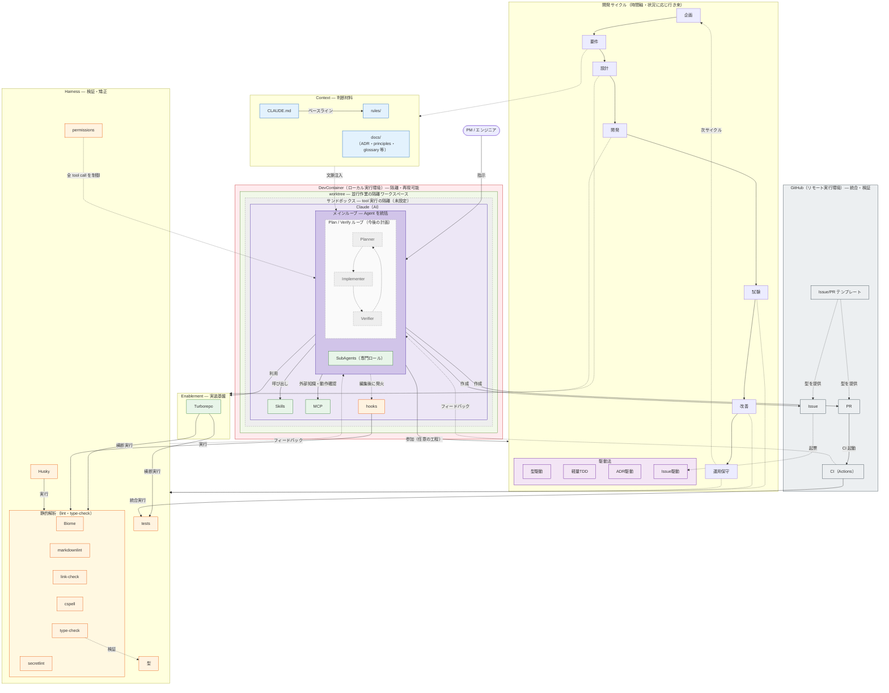

# AI 駆動開発の全体像

本リポジトリの AI（Claude Code）協働環境を構成する施策の全体像。各施策を 5 つの分類で整理し、それぞれが AI 駆動開発で果たす役割と、本リポジトリでの実体を棚卸しする。意思決定の背景は [ADR-0007](../adr/0007-ai-driven-dev-architecture.md) と [ADR-0011](../adr/0011-role-based-agent-architecture.md) を参照。

## 設計思想

ハーネスは「AI が迷わず動ける環境」ではなく、「**AI と人間が同じ制約の中で動く環境**」として設計している。ルールは AI を縛るためではなく、人間が書いても AI が書いても同じ品質になるための共通の型を提供する。

## 5 つの分類

| 分類 | 役割 | 一言で |
| --- | --- | --- |
| **Context** | AI に判断材料を注入する | AI が「何を知っているか」 |
| **Enablement** | AI の実装を可能にする土台 | AI が「何で作れるか」 |
| **Harness** | AI の生成物を検証・矯正する | AI の出力を「どう正すか」 |
| **Security** | 実行環境を隔離・防御する | AI を「どう包むか」 |
| **Methodology** | 進め方そのものを規定する | AI と「どう進めるか」 |

各施策は主分類で代表させつつ、性質が複数にまたがるものは補助分類を併記する（多重タグ）。

## 全体像

**メインループ**を中心に据えた統合図。メインループは配下の **Agent（SubAgents＝専門ロール、今後の Plan/Verify ループ）を内包**し、共通ツール（Skills・MCP）と hooks を介して動く。Claude は **ローカル実行環境（DevContainer ⊃ worktree ⊃ サンドボックス）** に入れ子で囲まれ、`push / PR` でつながる **GitHub（リモート実行環境）** が Issue / PR / CI を担う（Claude がテンプレートで Issue/PR を起こし、Issue が開発サイクルを、CI が統合検証を回す）。開発サイクルは **駆動法** を内包する。**2 軸構成**で、位置＝アクター / 実行環境（誰がどこで動くか）、色＝施策の分類を表す（**グレー破線は未稼働＝今後の計画・未設定**）。インベントリの分類とは 1:1 に対応させず、また図は主要な構造に絞るため**一部の施策（Drizzle・アーキテクチャ等）はインベントリ表のみに記載**する。線は、点線＝工程が主に駆動する分類・隔離境界、実線＝アクター・施策間の関係。

工程は厳密な逐次ではなく状況に応じて行き来する（[ADR-0006](../adr/0006-lightweight-agile-process.md) / [ADR-0010](../adr/0010-development-workflow.md)）。運用保守で得た知見が次サイクルへ還流する。施策はこのサイクルを回すために存在する。

## 施策インベントリ

「実装」は導入済み（済）・今後の計画（計画）・未設定の別。「発動契機」はいつ働くか、「効果の性質」はどう効くか（確率的＝示すが保証しない / 決定論的＝機械的に enforce・ブロック）を表す。

| 施策 | 実装 | 主分類 | 補助分類 | 発動契機 | 効果の性質 | AI 駆動開発での役割 | 本リポジトリの実体・状況 |
| --- | --- | --- | --- | --- | --- | --- | --- |
| CLAUDE.md | 済 | Context | — | 常時 | 確率的 | 常時ロードの規約・コマンド・原則ベースライン | `CLAUDE.md` |
| ドキュメント | 済 | Context | — | 参照時 | 確率的 | 詳細知識（guides / design / product / milestones） | `docs/` |
| ADR | 済 | Context | Methodology | 参照時 | 確率的 | 意思決定の根拠を記録（ADR 駆動） | `docs/adr/` |
| rules | 済 | Context | Harness | パスマッチ編集時 | 確率的 | パスマッチで追加制約を自動注入 | `.claude/rules/` |
| glossary | 済 | Context | — | 参照時 | 確率的 | 用語統一 | `docs/product/glossary.md` |
| principles | 済 | Context | — | 参照時 | 確率的 | 横断原則の SSoT | `docs/principles/` |
| 型（TypeScript） | 済 | Harness | Context | コンパイル時 | 決定論的 | コンパイル検証＋意図の表現 | 全 TS / `type-check` |
| テスト | 済 | Harness | Methodology | 実行時 | 決定論的 | 振る舞いの検証（軽量 TDD） | `bun run test` |
| hooks | 済 | Harness | — | tool call 後 | 決定論的 | tool call 後の自動 enforce | `.claude/hooks/` |
| Husky / lint-staged | 済 | Harness | — | commit 時 | 決定論的 | commit 前ゲート | `package.json` |
| Biome lint / format | 済 | Harness | — | ローカル実行・commit 前 | 決定論的 | 静的解析・整形 | `bun run lint` |
| CI（Actions） | 済 | Harness | — | push / PR 時 | 決定論的 | 統合検証（lint / type / test / spell / secret） | `.github/workflows/` |
| ドキュメント品質ハーネス | 済 | Harness | — | 実行・CI 時 | 決定論的 | markdownlint / link-check / cspell による文書検証 | `lint:md` / `lint:md-links` / `lint:spell` |
| permissions | 済 | Harness | Security | 全 tool call | 決定論的 | 全 tool call の許可 / 拒否網 | `.claude/settings.json` |
| Skills | 済 | Enablement | Harness | 明示呼び出し | 確率的 | 定型手順の自動化・再利用 | `.claude/skills/` |
| SubAgents | 済 | Enablement | Harness | 委譲時 | 確率的 | 専門視点の分離・知識の再利用 | `.claude/agents/` |
| MCP | 済 | Enablement | Context | 明示呼び出し | 確率的 | 外部知識（context7）・動作確認（playwright） | `enabledMcpjsonServers` |
| アーキテクチャ | 済 | Enablement | Context | 設計・実装時 | 確率的 | 層分離で実装場所が予測可能 | [ADR-0009](../adr/0009-architecture.md) |
| Drizzle（型生成） | 済 | Enablement | Harness | `db:generate` 時 | 決定論的 | スキーマ→型安全なクライアント生成 | `db:generate` / `packages/db` |
| Turborepo | 済 | Enablement | — | コマンド実行時 | 決定論的 | 全ワークスペース横断コマンドの予測可能な実行 | `turbo.json` |
| worktree | 済 | Enablement | — | 並行作業時 | 決定論的 | 並行セッションの隔離作業場 | [worktree.md](./worktree.md) |
| DevContainer | 済 | Security | Enablement | 環境起動時 | 決定論的 | 隔離された再現可能な開発環境 | [devcontainer.md](./devcontainer.md) |
| サンドボックス | 未設定 | Security | — | 全 tool call | 決定論的 | tool 実行の隔離 | 明示設定なし・プラットフォーム依存（実態の隔離は DevContainer + permissions が担う） |
| secretlint | 済 | Security | Harness | 実行・commit 前 | 決定論的 | 機密情報の検出 | `bun run lint:secret` |
| Issue/PR テンプレート | 済 | Methodology | Context | 起票 / PR 作成時 | 確率的 | 人間にも AI にも構造化入力を強制する型 | `.github/ISSUE_TEMPLATE/` / `PULL_REQUEST_TEMPLATE.md` |
| 駆動法群 | 済 | Methodology | — | 全工程 | 確率的 | 型駆動 / 軽量 TDD / ADR 駆動 / Issue 駆動 | [ADR-0010](../adr/0010-development-workflow.md)（駆動法定義） / [ADR-0006](../adr/0006-lightweight-agile-process.md)（前提整備） |
| Plan / Verify ループ | 計画 | Enablement | Methodology | 自律実行時 | 確率的 | Planner / Implementer / Verifier の自律ループ（計画→実装→検証→修復） | 今後の計画（本文「今後の計画」節） |

## 各分類の設計意図

### Context — 文脈の経済性

**問い**: なぜ全部を CLAUDE.md に書かないのか？

コンテキストウィンドウは有限なリソース。常時ロードするものはプロジェクト横断で必要な最小限にとどめ、ドメイン固有の知識は必要な瞬間だけ注入する。

| | CLAUDE.md | rules/ |
| --- | --- | --- |
| ロード条件 | 常時（セッション起動時） | frontmatter の `paths:` に一致するファイルを編集したとき |
| 設計意図 | コンテキストのベースライン | ドメイン固有の追加制約。CLAUDE.md の補完 |
| 置くもの | 全作業横断の規約・コマンド・原則 | 「そのパスを編集するときだけ必要な知識」 |

**rules/ と skills/ の関係**:

`write-design-doc` スキルと `design-docs.md` ルールは内容が一部重なる。意図的な重なりであり、役割の軸が違う。

| | rules/ | skills/ |
| --- | --- | --- |
| 発動 | 受動的（パスマッチで自動） | 能動的（明示的に呼び出し） |
| 設計意図 | スキルを使わない ad-hoc 編集でも制約を効かせる | 制約の確認 + 手順（SSoT チェック・コンプライアンス検証）を構造化する |

`write-product-doc` は `!cat docs/product/glossary.md` をスキル側に残している。glossary は随時更新される動的コンテンツであり、静的なパスマッチ制約を担う rules には馴染まないため意図的な非対称。

### Enablement — 視点と土台の分離

**問い**: なぜロールをスキル内に直接書かないのか？

複数のスキルが同じ専門視点を使う。インライン記述では同じ知識が散在し、一貫性が崩れる。エージェントを「専門知識の領域」として独立させることで、スキルは手順だけを担い、知識は再利用できる。

| エージェント | 専門領域 |
| --- | --- |
| `po` | プロダクト価値・JTBD |
| `pm` | 進捗・リスク・依存関係 |
| `architect` | 構造設計・ADR 整合性 |
| `qa` | テスト設計・品質・セキュリティ |
| `designer` | UI/UX・ブランド |

「レビュー」はエージェントとして定義しない。レビューは行為であり専門領域ではないため、`review` スキルが対象の種別を引数から推定し、適切なエージェントへ動的に委譲する（[ADR-0011](../adr/0011-role-based-agent-architecture.md)）。5 エージェントのうち `designer` は後から追加した（[ADR-0015](../adr/0015-add-designer-agent.md)）。

**MCP — 外部知識へのアクセス**: 訓練データのカットオフを超えた最新ドキュメントへのアクセスと、実ブラウザでの動作確認が必要なため導入する。ライブラリ選定・API 変更への追従は `context7` が担い、UI 実装の動作確認は `playwright` が担う。MCP は「外部ツール連携の必要性が生じたら導入」する方針（[ADR-0007](../adr/0007-ai-driven-dev-architecture.md)）。

**アーキテクチャ**: 層分離（[ADR-0009](../adr/0009-architecture.md)）により実装場所が予測可能になり、AI が迷わず正しい層に変更を入れられる。型もまた、コンパイル検証だけでなく実装意図を表現する土台として働く。

### Harness — 確実性と安全網

**問い**: なぜ「TS/TSX を編集したら lint をかけて」と AI に指示するだけでは不十分なのか？

指示は確率的に従われる。フックは決定論的に実行される。lint・format のように「必ず実行されなければ意味がない」副作用は、AI の判断を経由させない。

| フック | トリガー | 設計根拠 |
| --- | --- | --- |
| `post-edit-lint.sh` | Edit/Write 後に `*.ts` / `*.tsx` を検出 | ADR-0007 品質保証第 3 層 Phase 1。修正ループを AI に自動フィードバック |

hook コマンドは相対パス（`bash .claude/hooks/...`）のため、Claude Code はリポジトリまたは worktree のルートから起動することが前提。`.claude/` は git 追跡されるため worktree でも動作する。

検証は多層で働く。型チェック・テスト・Biome がローカルと commit 前（Husky / lint-staged）で走り、CI（Actions）が統合時に再検証する。

**permissions — 安全網の多重化**: AI への指示（CLAUDE.md の禁止事項）は前段の防御線、`permissions.deny` は最後の防御線。`rm -rf`・`git push --force`・`.env` 読み取りなどは、AI が判断を誤った場合でもハーネスが物理的にブロックする。「AI を信頼しないのではなく、**ミスが起きても取り返せる環境にする**」設計。

### Security — 隔離と防御

実行環境そのものを隔離して、AI の操作が外へ漏れない・壊さないようにする層。DevContainer（[ADR-0016](../adr/0016-devcontainer-integration.md)）が再現可能な隔離環境を提供し、`permissions.deny` が危険操作を環境レベルで遮断する。secretlint は機密情報のコミットを検出する（Harness と重なる多重タグ）。tool 実行サンドボックスは Claude Code のプラットフォーム機能だが、本リポジトリでは未設定（実態の隔離は DevContainer + permissions が担う）。

### Methodology — 駆動法

進め方そのものを型として規定する。型駆動（type-first）・軽量 TDD・ADR 駆動・Issue 駆動を組み合わせ、AI との協働サイクル（企画→要件→設計→開発→試験→改善→運用）を一気通貫で回す（[ADR-0006](../adr/0006-lightweight-agile-process.md) / [ADR-0010](../adr/0010-development-workflow.md)）。Issue/PR テンプレートは、この型を入力の段階から強制する。

## 多層防御：確率的 → 決定論的

インベントリの「効果の性質」列で施策を読み替えると、防御が二層に分かれる。

- **確率的な層（前段・速い・柔らかい）**: 指示・文脈（CLAUDE.md / rules / docs）、AI が呼び出す Skills・Agents・MCP。従う確率を上げるが保証はしない。
- **決定論的な層（後段・遅い・硬い）**: 型・lint・test・hooks・Husky・CI、最後に permissions.deny。AI の判断を経由せず機械的に enforce・ブロックする。

前段で速度を、後段で安全を担保する。指示（確率的）→ 自動修正フック → 統合検証 → permissions（決定論的）という段階は、[ADR-0007](../adr/0007-ai-driven-dev-architecture.md) の品質保証 3 層構成に対応する。

## 今後の計画：Plan / Verify エージェントループ

Anthropic が長時間稼働アプリ開発向けに示した [3 エージェントハーネス](https://www.anthropic.com/engineering/harness-design-long-running-apps) を、将来的に本リポジトリの開発サイクルへ取り込むことを構想している。これは既存の役割ベースエージェント（po / pm / architect / qa / designer、[ADR-0011](../adr/0011-role-based-agent-architecture.md)）とは**別系統**で、実装そのものを自律的に駆動するループを担う。Claude のサブインスタンスとして動くため、全体像図でも Claude ボックス内に点線クラスタとして示している。

| エージェント | 役割 |
| --- | --- |
| **Planner** | プロンプトや Issue を詳細な仕様へ展開する。スコープ・エッジケース・受入基準を、コード着手前に「正しい振る舞いとは何か」として構造化する（出力はコードではなく仕様） |
| **Implementer**（Generator） | 仕様をスプリント単位に分割し、段階的に実装する |
| **Verifier**（Evaluator） | 懐疑的な視点で稼働中のアプリを Playwright 等で実際に操作・検証し、具体的なバグレポートを返す。合格しきい値を機械的に課す |

3 者は「何をもって done とするか」をコード着手前に定めるスプリント契約で協調し、**計画 → 実装 → 検証 → 修復**のループを回す。単一エージェントより信頼性が高い反面、コストも高い。

現状この役割は implement-feature スキルの type-first + 軽量 TDD 手順、`review` / `resolve-review` スキル、qa エージェントが部分的・人手駆動で担っている。エージェントループとしての自律実行は MVP のスコープ外であり、長時間の自律開発が必要になった段階で ADR 化のうえ導入を検討する。

## 追加判断の軸

| 対象 | 追加してよい条件 |
| --- | --- |
| **rule** | 「特定のファイルパスを編集するときだけ必要な制約」か。CLAUDE.md に書くべき横断的な内容を rules に移さない（文脈の経済性が崩れる） |
| **skill** | 「繰り返し実行でき、手順が定型化できるか」（ADR-0007 の基準）。手順が定まらない作業はスキル化せず、その都度 AI と対話する |
| **agent** | 既存 5 エージェントでカバーできない独立した専門知識の領域があるか。「行為」ではなく「専門領域」として定義できるか（ADR-0011 の原則） |
| **hook** | 「AI の判断を経由させると確実性が下がる副作用」か。lint・format のような自動修正が対象。確認を要する操作はフックにしない |

## 参照

| ドキュメント | 内容 |
| --- | --- |
| [ADR-0007](../adr/0007-ai-driven-dev-architecture.md) | ハイブリッドエージェント方式・品質保証 3 層構成の採択理由 |
| [ADR-0011](../adr/0011-role-based-agent-architecture.md) | エージェントを「専門知識の領域」として定義する原則 |
| [ADR-0015](../adr/0015-add-designer-agent.md) | designer エージェントの追加（UI/UX・ブランド領域） |
| [ADR-0009](../adr/0009-architecture.md) | アーキテクチャ（層分離） |
| [ADR-0006](../adr/0006-lightweight-agile-process.md) | 軽量アジャイルプロセス（駆動法群の前提整備） |
| [ADR-0010](../adr/0010-development-workflow.md) | 開発ワークフロー（駆動法の定義） |
| [ADR-0012](../adr/0012-git-worktree-parallel-sessions.md) | Git Worktree 並行セッション（worktree の採択理由） |
| [ADR-0016](../adr/0016-devcontainer-integration.md) | DevContainer 統合（隔離開発環境の採択理由） |
| [ADR-0013](../adr/0013-doc-placement-policy.md) | docs/product/ と docs/design/ の配置ポリシー |
| [ADR-0021](../adr/0021-doc-cross-reference-policy.md) | ドキュメント間参照ポリシー |
| [ADR-0024](../adr/0024-playwright-mcp-for-ai-verification.md) | Playwright MCP 採択理由 |
| [docs/principles/README.md](../principles/README.md) | 設計・開発原則の SSoT |
| [devcontainer.md](./devcontainer.md) | DevContainer 構成・DB モード・認証共有 |
| [worktree.md](./worktree.md) | Git Worktree 並行セッション運用 |
