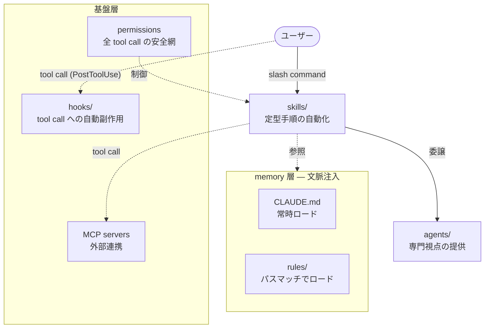

# AI 駆動開発ハーネス

本リポジトリの Claude Code 協働環境の設計。意思決定の背景は [ADR-0007](../adr/0007-ai-driven-dev-architecture.md) と [ADR-0011](../adr/0011-role-based-agent-architecture.md) を参照。

## 設計思想

ハーネスは「AI が迷わず動ける環境」ではなく、「**AI と人間が同じ制約の中で動く環境**」として設計している。ルールは AI を縛るためではなく、人間が書いても AI が書いても同じ品質になるための共通の型を提供する。

## 全体構成

## 各コンポーネントの設計意図

### CLAUDE.md + rules/ — 文脈の経済性

**問い**: なぜ全部を CLAUDE.md に書かないのか？

コンテキストウィンドウは有限なリソース。常時ロードするものはプロジェクト横断で必要な最小限にとどめ、ドメイン固有の知識は必要な瞬間だけ注入する。

| | CLAUDE.md | rules/ |
| --- | --- | --- |
| ロード条件 | 常時（セッション起動時） | frontmatter の `paths:` に一致するファイルを編集したとき |
| 設計意図 | コンテキストのベースライン | ドメイン固有の追加制約。CLAUDE.md の補完 |
| 置くもの | 全作業横断の規約・コマンド・原則 | 「そのパスを編集するときだけ必要な知識」 |

**rules/ と skills/ の関係**:

`write-design-doc` スキルと `design-docs.md` ルールは内容が一部重なる。意図的な重なりであり、役割の軸が違う。

| | rules/ | skills/ |
| --- | --- | --- |
| 発動 | 受動的（パスマッチで自動） | 能動的（明示的に呼び出し） |
| 設計意図 | スキルを使わない ad-hoc 編集でも制約を効かせる | 制約の確認 + 手順（SSoT チェック・コンプライアンス検証）を構造化する |

`write-product-doc` は `!cat docs/product/glossary.md` をスキル側に残している。glossary は随時更新される動的コンテンツであり、静的なパスマッチ制約を担う rules には馴染まないため意図的な非対称。

スキルの `!cat README.md` による動的注入は rules に統合し、スキル側から削除した。rules がパスマッチで制約を自動注入するため、スキルを使わない ad-hoc 編集でも同じ制約が働く。

### agents/ — 視点の分離

**問い**: なぜロールをスキル内に直接書かないのか？

複数のスキルが同じ専門視点を使う。インライン記述では同じ知識が散在し、一貫性が崩れる。エージェントを「専門知識の領域」として独立させることで、スキルは手順だけを担い、知識は再利用できる。

| エージェント | 専門領域 |
| --- | --- |
| `po` | プロダクト価値・JTBD |
| `pm` | 進捗・リスク・依存関係 |
| `architect` | 構造設計・ADR 整合性 |
| `qa` | テスト設計・品質・セキュリティ |
| `designer` | UI/UX・ブランド |

「レビュー」はエージェントとして定義しない。レビューは行為であり専門領域ではないため、`review` スキルが対象に応じてエージェントを組み合わせる（ADR-0011）。

### hooks/ — 確実性の担保

**問い**: なぜ「TS/TSX を編集したら lint をかけて」と AI に指示するだけでは不十分なのか？

指示は確率的に従われる。フックは決定論的に実行される。lint・format のように「必ず実行されなければ意味がない」副作用は、AI の判断を経由させない。

現在のフック:

| フック | トリガー | 設計根拠 |
| --- | --- | --- |
| `post-edit-lint.sh` | Edit/Write 後に `*.ts` / `*.tsx` を検出 | ADR-0007 品質保証第 3 層 Phase 1。修正ループを AI に自動フィードバック |

hook コマンドは相対パス（`bash .claude/hooks/...`）のため、Claude Code はリポジトリまたは worktree のルートから起動することが前提。`.claude/` は git 追跡されるため worktree でも動作する。

Stop hook・PreToolUse hook は「コスト > 効果」と判断し未導入。フックは増やすほど実行コストが上がるため、追加は慎重に行う。

### MCP — 外部知識へのアクセス

**問い**: なぜ MCP サーバーを使うのか？

訓練データのカットオフを超えた最新ドキュメントへのアクセスと、実ブラウザでの動作確認が必要なため。ライブラリ選定・API 変更への追従は `context7` が担い、UI 実装の動作確認は `playwright` が担う。

MCP は「外部ツール連携の必要性が生じたら導入」する方針（ADR-0007）。現在は 2 サーバーのみ。

### permissions — 安全網の多重化

**問い**: AI への指示（CLAUDE.md の禁止事項）だけでは不十分か？

指示は前段の防御線。`permissions.deny` は最後の防御線。`rm -rf`・`git push --force`・`.env` 読み取りなどは、AI が判断を誤った場合でもハーネスが物理的にブロックする。

「AI を信頼しないのではなく、**ミスが起きても取り返せる環境にする**」設計。

## 追加判断の軸

### rule を追加するとき

「特定のファイルパスを編集するときだけ必要な制約」かどうか。CLAUDE.md に書くべき横断的な内容を rules に移さない（文脈の経済性が崩れる）。

### skill を追加するとき

「繰り返し実行でき、手順が定型化できるか」（ADR-0007 の基準）。手順が定まらない作業はスキル化せず、その都度 AI と対話する。

### agent を追加するとき

既存 5 エージェントでカバーできない独立した専門知識の領域があるか。「行為」ではなく「専門領域」として定義できるか（ADR-0011 の原則）。

### hook を追加するとき

「AI の判断を経由させると確実性が下がる副作用」かどうか。lint・format のような自動修正が対象。確認を要する操作はフックにしない（permissions や AI への指示で対応）。

## 参照

| ドキュメント | 内容 |
| --- | --- |
| [ADR-0007](../adr/0007-ai-driven-dev-architecture.md) | ハイブリッドエージェント方式・品質保証 3 層構成の採択理由 |
| [ADR-0011](../adr/0011-role-based-agent-architecture.md) | エージェントを「専門知識の領域」として定義する原則 |
| [ADR-0013](../adr/0013-doc-placement-policy.md) | docs/product/ と docs/design/ の配置ポリシー |
| [ADR-0021](../adr/0021-doc-cross-reference-policy.md) | ドキュメント間参照ポリシー（rules が引用する基盤 ADR） |
| [ADR-0024](../adr/0024-playwright-mcp-for-ai-verification.md) | Playwright MCP 採択理由 |
| [docs/principles/README.md](../principles/README.md) | 設計・開発原則の SSoT |
| [devcontainer.md](./devcontainer.md) | DevContainer 構成・DB モード・認証共有 |
| [worktree.md](./worktree.md) | Git Worktree 並行セッション運用 |
