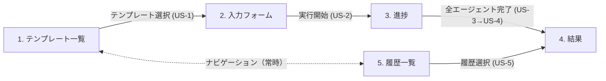

# 画面一覧・画面遷移図（MVP）

MVP で提供する画面の一覧・遷移・US マッピング。web 実装 Issue 分解時の粒度合わせと、画面名・役割の共通参照を目的とする。

本ドキュメントは UX の構造（画面・遷移）のみを扱う。URL ルートや画面識別子等の技術詳細は [design/ui-patterns.md](../design/ui-patterns.md) 側で定義する。前提は [ADR-0005 MVP スコープ](../adr/0005-mvp-scope.md) と [user-stories.md](./user-stories.md)。

## 画面一覧

| # | 画面名 | 役割 | 対応 US |
| --- | --- | --- | --- |
| 1 | テンプレート一覧 | 利用可能なテンプレート（MVP では競合調査の 1 種）を表示し、選択可能にする | [US-1](./user-stories.md#us-1-テンプレートを選んで調査を始める) |
| 2 | 入力フォーム | 選択したテンプレートのパラメータスキーマに沿って入力項目を生成し、実行開始トリガーを提供する | [US-2](./user-stories.md#us-2-調査パラメータを入力して実行する) |
| 3 | 進捗 | 実行中エージェントのステータスと出力を WebSocket 経由でリアルタイム表示する | [US-3](./user-stories.md#us-3-エージェントの進捗をリアルタイムで見る) |
| 4 | 結果 | 全エージェント完了後の統合レポートを観点×競合のマトリクス形式で表示し、Markdown エクスポートを提供する | [US-4](./user-stories.md#us-4-統合結果を閲覧しエクスポートする) / [US-5](./user-stories.md#us-5-過去の実行履歴を振り返る)（再閲覧） |
| 5 | 履歴一覧 | 過去の実行をテンプレート名・実行日時・ステータスで一覧表示し、結果画面への再アクセスを提供する | [US-5](./user-stories.md#us-5-過去の実行履歴を振り返る) |

## 画面遷移図

### 遷移の補足

- **主要導線**: テンプレート一覧 → 入力フォーム → 進捗 → 結果。JTBD「30 分以内の競合比較完遂」（ADR-0005）の基本フロー
- **履歴経由の再閲覧**: 履歴一覧 → 結果。US-5 は US-4 と同じ結果画面を再利用
- **ナビゲーション**: テンプレート一覧と履歴一覧は全画面から常時アクセス可能（グローバルナビ想定）。進捗画面から離脱しても実行はバックグラウンドで継続するが、リロード時の状態復元は MVP スコープ外
- **失敗時の取り扱い**:
  - 実行開始失敗（US-2）: バリデーションエラー・LLM API 障害のいずれも入力フォームに留まり、原因が判別できるエラーメッセージを表示
  - エージェント失敗（US-3）: 進捗画面で失敗メッセージを表示
  - 統合エージェント失敗（US-4）: 結果画面に遷移し、個別エージェントの結果を表示
  - 全エージェント失敗（US-4）: 結果画面に遷移し、失敗した旨と原因（判別可能な範囲）を表示
- **リロード挙動**: 実行中のページリロード時の状態復元は MVP スコープ外（user-stories.md Non-goals）。完了実行の結果画面は再訪可能

## 画面 × 受け入れ基準マッピング

各画面が満たす [user-stories.md](./user-stories.md) の受け入れ基準。**一次ソースは [user-stories.md](./user-stories.md)**。本節は画面単位で参照しやすい形にまとめた抜粋で、AC 更新時は user-stories.md を正として本節を追従させる。

### 1. テンプレート一覧（US-1）

- テンプレート一覧画面で、MVP シードテンプレート（競合調査）が表示される
- テンプレートごとに名前・説明・エージェント構成（ロール一覧）が閲覧できる
- テンプレートを選択すると、入力フォーム画面に遷移する

### 2. 入力フォーム（US-2）

- 選択したテンプレートのパラメータスキーマに沿って入力フォームが生成される
- 必須項目が未入力の場合、実行ボタンが押下できない（もしくはエラー表示）
- 参考情報（ユーザーが手動で貼り付けたテキスト）を任意で添付できる
- 実行ボタン押下で新規実行が作成され、進捗画面に遷移する
- 実行開始に失敗した場合、原因が判別できるメッセージが表示される

### 3. 進捗（US-3）

- 各エージェント（観点別調査役・統合役）のステータスが「待機 / 実行中 / 完了 / 失敗」で表示される
- 実行中のエージェントの出力がストリーミング表示される
- エージェントが失敗した場合、失敗メッセージが表示される

### 4. 結果（US-4 / US-5 からの再閲覧）

- 全エージェント完了後、統合レポートが表示される
- 観点×競合のマトリクス形式で表示される
- Markdown としてコピーできる
- Markdown ファイルとしてダウンロードできる
- 統合エージェントが失敗した場合、個別エージェントの結果は確認できる
- 全エージェントが失敗した場合、失敗した旨と原因が表示される
- 完了した実行の結果画面はページリロード後も閲覧できる

### 5. 履歴一覧（US-5）

- 過去実行のテンプレート名・実行日時・ステータスが閲覧できる
- 新しい順にソートされる
- 一覧から任意の実行を選択すると結果画面に遷移する
- 履歴が 0 件のときは空状態メッセージが表示される

## 未決事項

- **空状態の表現**: 履歴 0 件以外にもテンプレート 0 件等の空状態があり得るが、MVP では履歴のみ想定（テンプレートはシードで常に 1 件以上）
